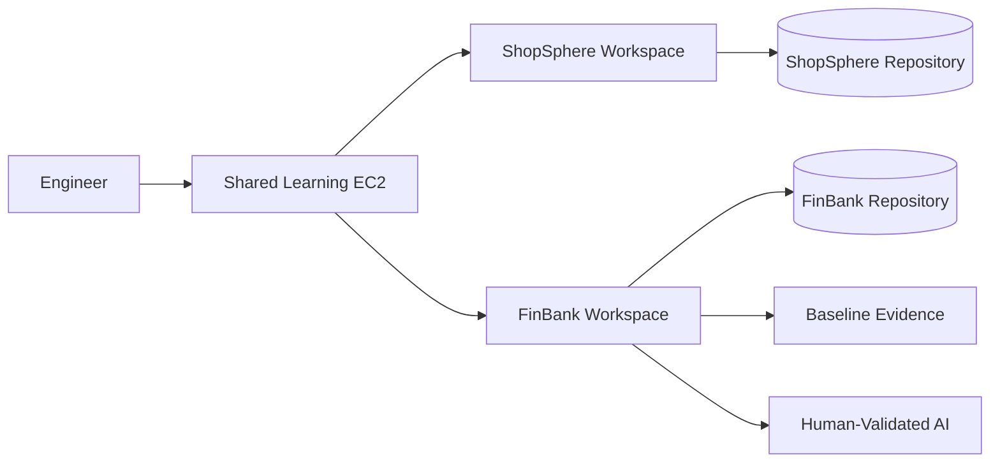

# 🚀 Day 001: Engineering Baseline & Repository Safety

### 🏦 FinBank AI DevSecOps · Foundation Phase · Day 1 of 120

![Status][badge-status]
![Phase][badge-phase]
![Linux][badge-linux]
![AWS][badge-aws]
![Banking][badge-banking]
![AI][badge-ai]

**Evidence-driven foundation for repository isolation, Linux operations, AWS safety, cost governance and responsible AI.**

---

## 🧭 Quick Navigation

| Learn | Build | Validate | Prepare |
|---|---|---|---|
| [🧠 Concepts](concepts.md) | [🧪 Lab](lab_guide.md) | [✅ Testing](testing_strategy.md) | [🎯 Interview](interview_questions.md) |
| [🐧 Commands](commands.md) | [🏗️ Architecture](architecture.md) | [🔐 Security](security_notes.md) | [🚨 Troubleshooting](troubleshooting.md) |
| [🏦 Banking](banking_relevance.md) | [🤖 AI Workflow](ai_assisted_workflow.md) | [📸 Evidence](screenshot_checklist.md) | [🏁 Summary](summary.md) |
| [💰 Cost](aws_cost_shutdown.md) | [📝 Notes](lab_notes.md) | [🌿 Git](git_workflow.md) | [🎨 Style](visual_style_guide.md) |

## 📊 Completion Dashboard

| Workstream | Evidence | Status |
|---|---|:---:|
| Repository isolation | Separate roots and remotes | ✅ |
| Linux baseline | OS, kernel, CPU, memory and disk | ✅ |
| Toolchain inventory | Versions recorded | ✅ |
| AWS safety | CLI checked without exposing credentials | ✅ |
| Security validation | Secret-pattern scan and diff check | ✅ |
| Troubleshooting | Safe missing-remote failure | ✅ |
| AI governance | Human-validation boundary | ✅ |
| Cost governance | No new cloud resource | ✅ |

**Progress:** `Day 001 / 120` ▰▱▱▱▱▱▱▱▱▱

> [!IMPORTANT]
> Run every FinBank command from `/home/ubuntu/Projects/FinBank-AI-DevSecOps`. Verify repository root, branch, remote and staged diff before every push.

## 🏦 Banking Control Mapping

| Expectation | Day 001 control | Engineering value |
|---|---|---|
| Traceability | Branch, commit and evidence | Reconstructs changes |
| Segregation | Separate `.git` roots and remotes | Prevents contamination |
| Least privilege | No long-lived AWS key | Reduces unauthorized action |
| Audit readiness | Host and tool baseline | Creates repeatable evidence |
| Data protection | Synthetic data only | Protects confidentiality |

> [!CAUTION]
> Never commit credentials, tokens, private keys, account identifiers, real customer data or real payment data.

## 🏗️ Environment Architecture

## 📸 Evidence Gallery

| ID | Filename | Required proof |
|:---:|---|---|
| 001 | `001_Repository_Isolation_Verified.png` | Separate roots and remotes |
| 002 | `002_Linux_Host_Baseline.png` | OS, kernel, CPU, memory and disk |
| 003 | `003_DevOps_Toolchain_Inventory.png` | Tool versions |
| 004 | `004_Security_Validation_Passed.png` | Security checks |
| 005 | `005_Day001_Git_Review.png` | Final Git review |

## ✅ Definition of Done

- [x] Repository isolation verified
- [x] Baselines generated
- [x] AWS CLI behavior recorded
- [x] Safe failure completed
- [x] Premium package corrected
- [ ] Screenshots committed
- [ ] Pull request merged

---

**🏦 FinBank AI DevSecOps**
*Learn deeply · Build safely · Validate everything · Document professionally*

[badge-status]: https://img.shields.io/badge/STATUS-COMPLETED-2EA44F?style=for-the-badge&logo=githubactions&logoColor=white
[badge-phase]: https://img.shields.io/badge/PHASE-FOUNDATION-1F6FEB?style=for-the-badge
[badge-linux]: https://img.shields.io/badge/PLATFORM-LINUX-FCC624?style=for-the-badge&logo=linux&logoColor=black
[badge-aws]: https://img.shields.io/badge/CLOUD-AWS-FF9900?style=for-the-badge&logo=amazonaws&logoColor=white
[badge-banking]: https://img.shields.io/badge/DOMAIN-BANKING-8A2BE2?style=for-the-badge
[badge-ai]: https://img.shields.io/badge/AI-HUMAN_VALIDATED-00A4EF?style=for-the-badge
