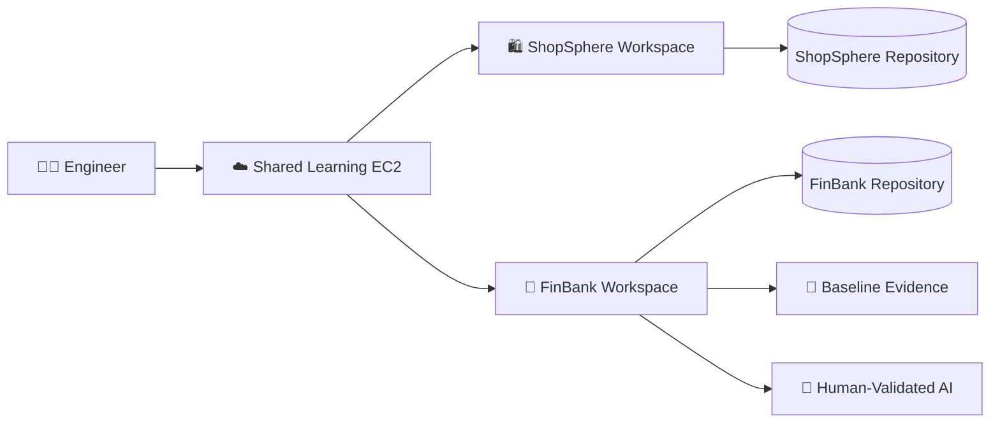

# 🚀 Day 001: Engineering Baseline & Repository Safety

### 🏦 FinBank AI DevSecOps • Foundation Phase • Day 1 of 120

**Evidence-driven foundation for repository isolation, Linux operations, AWS safety, cost governance and responsible AI.**

---

## 🧭 Quick Navigation

| Learn | Build | Validate | Prepare |
|---|---|---|---|
| [🧠 Concepts](concepts.md) | [🧪 Lab](lab_guide.md) | [✅ Testing](testing_strategy.md) | [🎯 Interview](interview_questions.md) |
| [🐧 Commands](commands.md) | [🏗️ Architecture](architecture.md) | [🔐 Security](security_notes.md) | [🚨 Troubleshooting](troubleshooting.md) |
| [🏦 Banking](banking_relevance.md) | [🤖 AI Workflow](ai_assisted_workflow.md) | [📸 Evidence](screenshot_checklist.md) | [🏁 Summary](summary.md) |
| [💰 Cost](aws_cost_shutdown.md) | [📝 Notes](lab_notes.md) | [🌿 Git](git_workflow.md) | [🎨 Style](visual_style_guide.md) |

## 📊 Completion Dashboard

| Workstream | Evidence | Status |
|---|---|:---:|
| Repository isolation | Separate roots and remotes | ✅ |
| Linux baseline | OS, kernel, CPU, memory, disk | ✅ |
| Toolchain inventory | Engineering versions recorded | ✅ |
| AWS safety | CLI tested without exposing credentials | ✅ |
| Security validation | Secret pattern and diff checks | ✅ |
| Troubleshooting | Safe missing-remote failure | ✅ |
| AI governance | Human validation boundary | ✅ |
| Cost governance | No new cloud resource | ✅ |

**Progress:** `Day 001 / 120` ▰▱▱▱▱▱▱▱▱▱

> [!IMPORTANT]
> Every FinBank command must run from `/home/ubuntu/Projects/FinBank-AI-DevSecOps`. Confirm the repository root, branch, remote and staged diff before every push.

## 🏦 Banking Control Mapping

| Expectation | Day 001 control | Value |
|---|---|---|
| Traceability | Branch, commit and evidence | Reconstructs changes |
| Segregation | Separate `.git` roots/remotes | Prevents contamination |
| Least privilege | No long-lived AWS key | Reduces unauthorized action |
| Audit readiness | Host and tool baseline | Repeatable evidence |
| Data protection | Synthetic data only | Preserves confidentiality |

> [!CAUTION]
> Never commit credentials, tokens, private keys, account identifiers, real customer data or real payment data.

## 🏗️ Environment Architecture

## 📸 Evidence Gallery

| ID | File | Proof |
|:---:|---|---|
| 001 | `001_Repository_Isolation_Verified.png` | Separate roots/remotes |
| 002 | `002_Linux_Host_Baseline.png` | Host baseline |
| 003 | `003_DevOps_Toolchain_Inventory.png` | Tool versions |
| 004 | `004_Security_Validation_Passed.png` | Security checks |
| 005 | `005_Day001_Git_Review.png` | Final Git review |

## ✅ Definition of Done

- [x] Isolation verified
- [x] Baselines generated
- [x] AWS CLI behavior recorded
- [x] Safe failure completed
- [x] Premium documentation redesigned
- [ ] Screenshots committed
- [ ] Pull request merged

---

<strong>🏦 FinBank AI DevSecOps</strong> Learn deeply • Build safely • Validate everything • Document professionally

