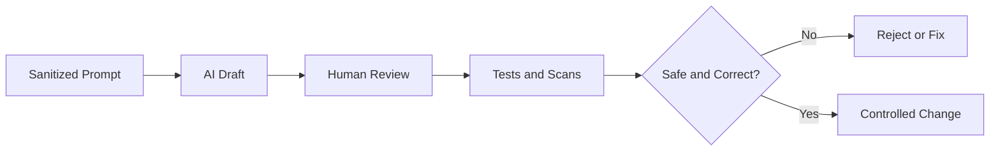

[🏠 Overview](README.md) · [🧠 Concepts](concepts.md) · [🧪 Lab](lab_guide.md) · [🚨 Troubleshooting](troubleshooting.md) · [🎯 Interview](interview_questions.md) · [📸 Evidence](screenshot_checklist.md)

---

# 🤖 Responsible AI-Assisted DevOps

## 🧩 Prompt Contract
| Element | Requirement |
|---|---|
| Context | Sanitized facts and errors |
| Task | One specific outcome |
| Constraints | Read-only first and no secrets |
| Evidence | Exact safe logs or plans |
| Output | Hypotheses, validation and rollback |

## ✅ Validation Pipeline

> [!CAUTION]
> AI has no authority to expose data, disable controls, approve payments or run unrestricted production remediation.

---

**🏦 FinBank AI DevSecOps · Day 001 of 120**
*Learn · Build · Validate · Secure · Document · Improve*
