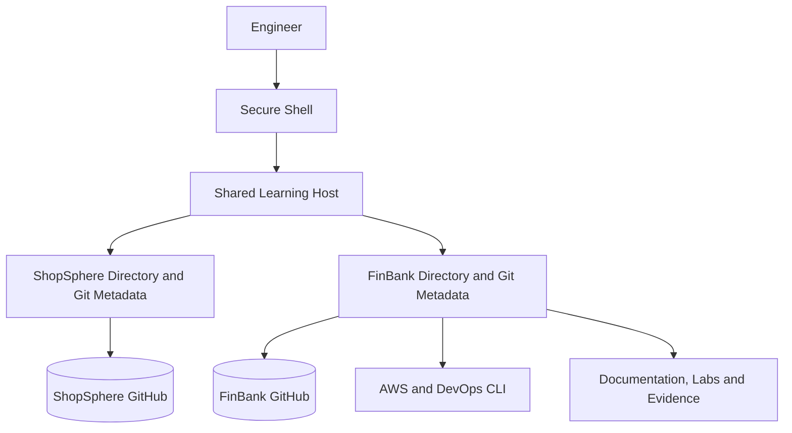

[🏠 Overview](README.md) · [🧠 Concepts](concepts.md) · [🧪 Lab](lab_guide.md) · [🚨 Troubleshooting](troubleshooting.md) · [🎯 Interview](interview_questions.md) · [📸 Evidence](screenshot_checklist.md)

---

# 🏗️ Learning Environment Architecture

## 🔐 Isolation Boundary
The projects share compute only. Git metadata, histories, remotes, configurations and deployment targets remain separate.

> [!IMPORTANT]
> Future FinBank resources receive separate names, tags, state and CI/CD identities.

---

**🏦 FinBank AI DevSecOps · Day 001 of 120**
*Learn · Build · Validate · Secure · Document · Improve*
