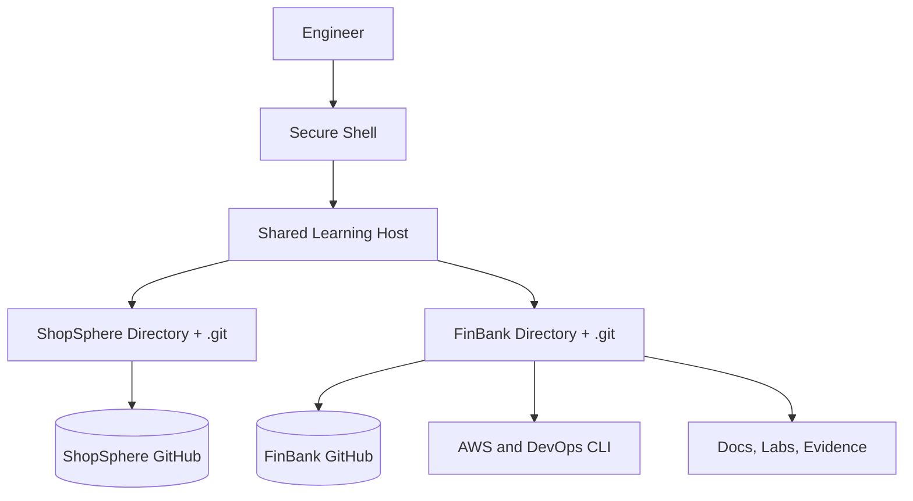

  <a href="README.md">🏠 Overview</a> • <a href="concepts.md">🧠 Concepts</a> • <a href="lab_guide.md">🧪 Lab</a> • <a href="troubleshooting.md">🚨 Troubleshooting</a> • <a href="interview_questions.md">🎯 Interview</a> • <a href="screenshot_checklist.md">📸 Evidence</a>

---

# 🏗️ Learning Environment Architecture

## 🗺️ Context Diagram

## 🔐 Isolation Boundary
The repositories share compute only. They do not share Git metadata, histories, remotes, application configuration or deployment targets.

> [!IMPORTANT]
> Future FinBank resources receive separate names, tags, Terraform state and CI/CD identities. ShopSphere resources are not reused without an explicit architecture decision.
---

<strong>🏦 FinBank AI DevSecOps • Day 001 of 120</strong> Learn • Build • Validate • Secure • Document • Improve

