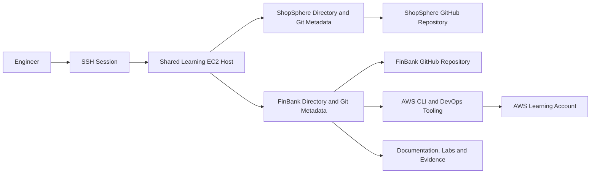

# Day 001 Learning Environment Architecture

## Isolation boundary
The repositories share compute only. They do not share `.git`, source trees, branches, remotes, documentation or application configuration.

## Future target
The EC2 host may act as a controlled learning workstation. FinBank workloads will later be deployed to separately named AWS resources through Terraform and CI/CD. Resource names, tags, state and credentials must never be reused from ShopSphere without an explicit reviewed design.
