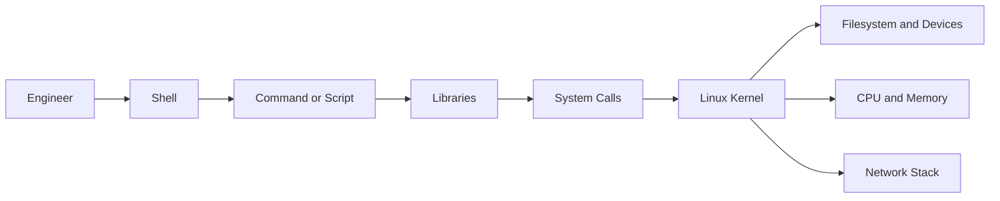

# 🐧 Day 002: Linux Architecture, Shell & Filesystem Hierarchy

### 🏦 FinBank AI DevSecOps · Foundation Phase · Day 2 of 120

🟢 **STATUS: READY** · 🔵 **PHASE: FOUNDATION** · 🟡 **PLATFORM: LINUX** · 🟣 **DOMAIN: BANKING** · 🤖 **AI: HUMAN-VALIDATED**

> A premium, evidence-driven module for understanding how Linux starts, organizes storage, resolves paths, separates runtime and persistent data, and supports secure banking workloads.

---

## 🧭 Quick Navigation

| Learn | Build | Validate | Prepare |
|---|---|---|---|
| [🧠 Concepts](concepts.md) | [🧪 Lab](lab_guide.md) | [✅ Testing](testing_strategy.md) | [🎯 Interview](interview_questions.md) |
| [🐧 Commands](commands.md) | [🏗️ Architecture](architecture.md) | [🔐 Security](security_notes.md) | [🚨 Troubleshooting](troubleshooting.md) |
| [🏦 Banking](banking_relevance.md) | [🤖 AI Workflow](ai_assisted_workflow.md) | [📸 Evidence](screenshot_checklist.md) | [🏁 Summary](summary.md) |
| [💰 Cost](aws_cost_shutdown.md) | [📝 Notes](lab_notes.md) | [🌿 Git](git_workflow.md) | [🎨 Style](visual_style_guide.md) |

## 🎯 Learning Outcomes

- Explain userspace, kernel space, system calls, processes and filesystems.
- Trace the Linux boot path from firmware to `systemd` services.
- Distinguish `/etc`, `/var`, `/run`, `/tmp`, `/proc`, `/sys`, `/dev`, `/home`, `/opt` and `/srv`.
- Resolve absolute, relative, canonical and symbolic-link paths safely.
- Inspect mounts, inodes, filesystem types and storage pressure.
- Build a non-destructive host inventory script with security validation.
- Map Linux directory decisions to banking security, audit and availability controls.

## 📊 Completion Dashboard

| Workstream | Required evidence | Status |
|---|---|:---:|
| Architecture | Kernel, shell, process and filesystem flow explained | ⬜ |
| Filesystem | Key FHS paths inventoried | ⬜ |
| Path handling | Absolute, relative and symlink behavior validated | ⬜ |
| Storage | Capacity, inode and mount checks recorded | ⬜ |
| Security | Sensitive-path and permission checks completed | ⬜ |
| Troubleshooting | Three safe failures diagnosed | ⬜ |
| Interview | Scenario answers rehearsed | ⬜ |
| Git | Reviewed branch pushed through PR | ⬜ |

**Progress:** `Day 002 / 120` ▰▱▱▱▱▱▱▱▱▱

> [!IMPORTANT]
> Day 002 uses read-only inspection and files created only under `labs/day002/` and `evidence/day002/`. Do not modify `/etc`, `/var`, `/boot`, `/usr`, `/proc`, `/sys` or ShopSphere.

## 🏗️ Linux Request Path

## 🏦 Banking Control Mapping

| Banking need | Linux foundation | Engineering value |
|---|---|---|
| Auditability | persistent logs under controlled storage | investigation trail |
| Availability | disk, inode and mount monitoring | prevents service outage |
| Confidentiality | ownership and directory permissions | limits unauthorized access |
| Integrity | immutable packages and reviewed configuration | reduces tampering |
| Resilience | separation of runtime and persistent state | safer recovery |

> [!CAUTION]
> Use synthetic data only. Never create mock credentials, customer records or payment details in world-readable directories.

## 📦 Day 002 Deliverables

- 17 interconnected premium documents
- Linux architecture and boot-flow diagrams
- Safe filesystem laboratory
- Automated host inventory script
- Positive, negative and recovery tests
- Exact evidence screenshot names and paths
- 5+ year production troubleshooting and interview preparation
- Security, AI validation, Git workflow and AWS shutdown guidance
