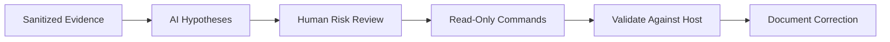

[🏠 Overview](README.md) · [🧠 Concepts](concepts.md) · [🧪 Lab](lab_guide.md) · [🚨 Troubleshooting](troubleshooting.md) · [🎯 Interview](interview_questions.md) · [📸 Evidence](screenshot_checklist.md)

---

# 🤖 AI-Assisted Linux Operations

## 🧩 Prompt Pattern
```text
Role: Senior Linux and DevSecOps engineer
Context: Sanitized command and exact error
Task: Rank hypotheses and propose read-only evidence commands
Constraints: No sudo, no deletion, no recursive permission changes
Output: Hypothesis, evidence, expected result, risk and rollback
```

## ✅ Validation Flow


## 🧪 Day 002 AI Exercise
Ask for three explanations of a disk-space mismatch. Verify every suggested command is read-only and targeted. Record which hypothesis the actual evidence supports.

> [!CAUTION]
> Reject commands that delete files, modify mounts, weaken permissions, stop services or alter system configuration without a separate reviewed change plan.

---

**🏦 FinBank AI DevSecOps · Day 002 of 120**
*Learn · Build · Validate · Secure · Document · Improve*
