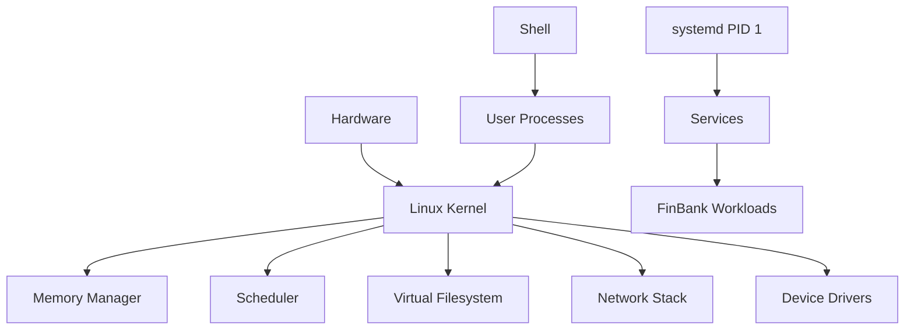
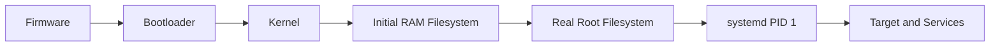

[🏠 Overview](README.md) · [🧠 Concepts](concepts.md) · [🧪 Lab](lab_guide.md) · [🚨 Troubleshooting](troubleshooting.md) · [🎯 Interview](interview_questions.md) · [📸 Evidence](screenshot_checklist.md)

---

# 🏗️ Linux Architecture & Boot Flow

## 🧱 Runtime Architecture

## 🚀 Boot Flow

## 🗂️ State Placement
- Configuration belongs in controlled configuration paths, not application source.
- Runtime state must tolerate reboot where appropriate.
- Persistent application data requires backup, ownership and recovery rules.
- Logs require rotation, access control and observability integration.

> [!WARNING]
> Do not treat `/tmp` or `/run` as durable storage. Do not place secrets in repository files or shared temporary paths.

---

**🏦 FinBank AI DevSecOps · Day 002 of 120**
*Learn · Build · Validate · Secure · Document · Improve*
