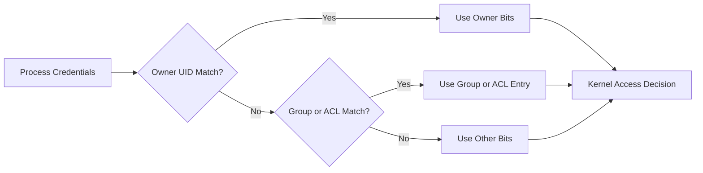

# 🔐 Day 003: Linux Users, Groups, Ownership & Permissions

### 🏦 FinBank AI DevSecOps · Foundation Phase · Day 3 of 120

🟢 **STATUS: READY** · 🔵 **PHASE: FOUNDATION** · 🟡 **PLATFORM: LINUX** · 🟣 **DOMAIN: BANKING** · 🤖 **AI: HUMAN-VALIDATED**

> A production-focused module for Linux identity, authorization, least privilege, file modes, ACLs, sudo governance and special permissions.

---

## 🧭 Quick Navigation

| Learn | Build | Validate | Prepare |
|---|---|---|---|
| [🧠 Concepts](concepts.md) | [🧪 Lab](lab_guide.md) | [✅ Testing](testing_strategy.md) | [🎯 Interview](interview_questions.md) |
| [⌨️ Commands](commands.md) | [🏗️ Architecture](architecture.md) | [🔐 Security](security_notes.md) | [🚨 Troubleshooting](troubleshooting.md) |
| [🏦 Banking](banking_relevance.md) | [🤖 AI Workflow](ai_assisted_workflow.md) | [📸 Evidence](screenshot_checklist.md) | [🏁 Summary](summary.md) |
| [💰 Cost](aws_cost_shutdown.md) | [📝 Notes](lab_notes.md) | [🌿 Git](git_workflow.md) | [🎨 Style](visual_style_guide.md) |

## 🎯 Learning Outcomes

- Explain UID, GID, primary and supplementary groups.
- Interpret account records without exposing password hashes.
- Calculate symbolic and octal permissions.
- Apply ownership, group inheritance, umask and ACL controls safely.
- Explain sudo policy, SUID, SGID and sticky-bit risk.
- Diagnose permission failures using identity, path and ACL evidence.
- Connect Linux authorization to banking segregation of duties.

## 📊 Completion Dashboard

| Workstream | Required evidence | Status |
|---|---|:---:|
| Identity | user, UID, GID and groups recorded | ⬜ |
| Authorization | mode evaluation and access matrix completed | ⬜ |
| Ownership | owner/group behavior validated | ⬜ |
| Umask | default creation permissions demonstrated | ⬜ |
| ACL | support detected and tested when available | ⬜ |
| Special modes | sticky, SUID and SGID inspected safely | ⬜ |
| Troubleshooting | safe failure and recovery documented | ⬜ |
| Git | controlled PR completed | ⬜ |

**Progress:** `Day 003 / 120` ▰▱▱▱▱▱▱▱▱▱

> [!IMPORTANT]
> Day 003 does not create operating-system users, edit `/etc/passwd`, read `/etc/shadow`, modify sudoers, or apply special permissions to system binaries. All writes remain under `labs/day003/` and `evidence/day003/`.

## 🏗️ Linux Authorization Decision

## 🏦 Banking Control Mapping

| Banking expectation | Linux control | Engineering value |
|---|---|---|
| least privilege | narrow user/group permissions | limits blast radius |
| segregation of duties | distinct service and operator identities | reduces conflict of interest |
| non-repudiation | attributable privileged activity | supports investigation |
| confidentiality | restrictive owner/group/ACL design | limits data exposure |
| controlled elevation | reviewed sudo policy | prevents unmanaged root access |

> [!CAUTION]
> Never use real customer data, credentials, private keys or payment records in permission labs. Synthetic content only.

## 📦 Enterprise Deliverables

- 17 premium GitHub-native documents
- Identity and permission architecture diagrams
- Safe no-sudo authorization laboratory
- Automated identity inventory and validation scripts
- Production troubleshooting for 5+ years experience
- Original MNC-style interview questions and model answers
- Nine exact screenshot checkpoints
- Banking security, AI validation, Git and cost controls
