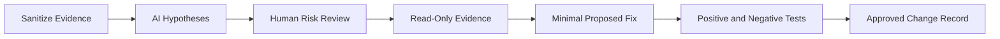

[🏠 Overview](README.md) · [🧠 Concepts](concepts.md) · [🧪 Lab](lab_guide.md) · [🚨 Troubleshooting](troubleshooting.md) · [🎯 Interview](interview_questions.md) · [📸 Evidence](screenshot_checklist.md)

---

# 🤖 AI-Assisted Permission Diagnosis

## 🧩 Safe Prompt Contract
```text
Role: Senior Linux security engineer
Context: Sanitized id, stat, namei and ACL output
Task: Rank permission-denied hypotheses
Constraints: Read-only evidence first; no sudo; no chmod 777; no recursive changes
Output: Hypothesis, evidence command, expected result, minimal fix, rollback and negative test
```

## ✅ Human Validation Pipeline


## 🧪 Day 003 Exercise
Provide sanitized output from `id`, `stat` and `namei -l` for the synthetic denied file. Compare the AI diagnosis with the known `000` mode root cause. Record any unnecessary or unsafe suggestion.

## 🚫 Automatic Rejection Rules
- Broad recursive changes
- World-writable permission proposals
- Reading shadow data
- Modifying sudoers directly
- Adding users to privileged groups as a shortcut
- Setting SUID on scripts or unknown binaries

> [!IMPORTANT]
> AI recommendations remain advisory. Privilege and authorization changes require human review, testing and auditable approval.

---

**🏦 FinBank AI DevSecOps · Day 003 of 120**
*Learn · Build · Validate · Secure · Document · Improve*
