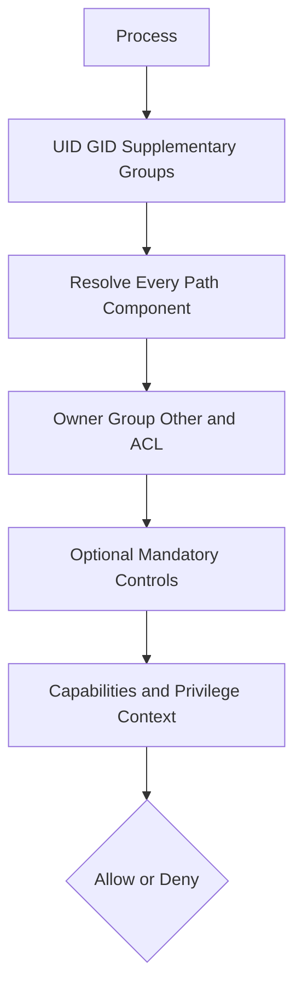
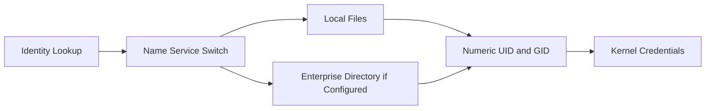

[🏠 Overview](README.md) · [🧠 Concepts](concepts.md) · [🧪 Lab](lab_guide.md) · [🚨 Troubleshooting](troubleshooting.md) · [🎯 Interview](interview_questions.md) · [📸 Evidence](screenshot_checklist.md)

---

# 🏗️ Linux Identity & Authorization Architecture

## 🔐 Access Decision Flow

## 👥 Identity Sources

## 🏦 Recommended Service Separation

| Identity | Responsibility | Prohibited access |
|---|---|---|
| payment service | payment orchestration runtime | direct audit-log mutation |
| ledger service | journal posting | deployment credentials |
| audit collector | append/forward audit events | payment initiation |
| deployment identity | release approved artifacts | customer business data |
| operator | diagnosis and approved controls | unrestricted persistent root shell |

> [!IMPORTANT]
> Separation of service identities is a design control. It must also be enforced through application authorization, cloud IAM, network policy and audit evidence.

---

**🏦 FinBank AI DevSecOps · Day 003 of 120**
*Learn · Build · Validate · Secure · Document · Improve*
