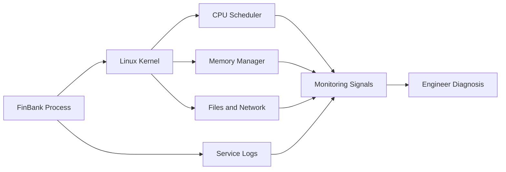

# 📈 Day 004: Linux Processes, Services & System Monitoring

### 🏦 FinBank AI DevSecOps · Foundation Phase · Day 4 of 120

🟢 **STATUS: READY** · 🔵 **PHASE: FOUNDATION** · 🟡 **PLATFORM: LINUX** · 🟣 **DOMAIN: BANKING** · 🤖 **AI: HUMAN-VALIDATED**

> A production-oriented module for process lifecycle, signals, systemd services, CPU and memory analysis, load averages, open files, safe failure injection, observability and banking incident response.

---

## 🧭 Quick Navigation

| Learn | Build | Validate | Prepare |
|---|---|---|---|
| [🧠 Concepts](concepts.md) | [🧪 Lab](lab_guide.md) | [✅ Testing](testing_strategy.md) | [🎯 Interview](interview_questions.md) |
| [⌨️ Commands](commands.md) | [🏗️ Architecture](architecture.md) | [🔐 Security](security_notes.md) | [🚨 Troubleshooting](troubleshooting.md) |
| [🏦 Banking](banking_relevance.md) | [🤖 AI Workflow](ai_assisted_workflow.md) | [📸 Evidence](screenshot_checklist.md) | [🏁 Summary](summary.md) |
| [💰 Cost](aws_cost_shutdown.md) | [📝 Notes](lab_notes.md) | [🌿 Git](git_workflow.md) | [🎨 Style](visual_style_guide.md) |

## 🎯 Learning Outcomes

- Explain PID, PPID, process states, scheduling, nice values and context switching.
- Distinguish process, thread, daemon, service, unit and cgroup.
- Use `ps`, `top`, `systemctl`, `journalctl`, `/proc`, `free`, `vmstat`, `uptime` and `ss` safely.
- Understand SIGTERM versus SIGKILL and apply graceful-stop-first behavior.
- Diagnose CPU, memory, load, zombie, failed-service and open-file scenarios.
- Build a safe synthetic workload, baseline report and automated validator.
- Connect host monitoring to payment availability, transaction integrity and auditability.

## 📊 Completion Dashboard

| Workstream | Evidence | Status |
|---|---|:---:|
| Process model | PID, PPID, state and command recorded | ⬜ |
| Resource baseline | CPU, load and memory captured | ⬜ |
| Services | systemd units and failed state inspected | ⬜ |
| Signals | graceful termination proven | ⬜ |
| Failure injection | CPU workload observed and stopped | ⬜ |
| Troubleshooting | production scenarios documented | ⬜ |
| Security | process and service exposure reviewed | ⬜ |
| Git | validated PR completed | ⬜ |

**Progress:** `Day 004 / 120` ▰▱▱▱▱▱▱▱▱▱

> [!IMPORTANT]
> All Day 004 write operations remain under `labs/day004/` and `evidence/day004/`. Do not stop system services, kill unrelated processes, modify unit files, or use unbounded stress workloads.

## 🏗️ Operational Signal Flow

## 🏦 Banking Control Mapping

| Banking concern | Linux signal/control | Operational value |
|---|---|---|
| payment availability | process and service health | detects interruption |
| latency | load, CPU, memory and I/O evidence | identifies saturation |
| transaction integrity | graceful shutdown and recovery | reduces partial work |
| auditability | service logs and timestamps | reconstructs incidents |
| security | process identity and listening ports | limits unauthorized exposure |

> [!CAUTION]
> Never terminate an unfamiliar process based only on CPU usage. Confirm owner, parent, command, service association, business impact and recovery plan first.

## 📦 Enterprise Deliverables

- 17 premium GitHub-native documents
- Three Mermaid architecture and diagnosis diagrams
- Four production-ready shell scripts
- Safe CPU workload and graceful-stop lab
- Automated process baseline and validation
- Ten production troubleshooting scenarios
- Fifteen original senior interview questions
- Nine exact screenshot checkpoints
- Incident, service-review and capacity templates
