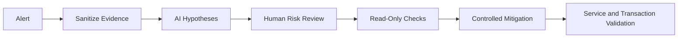

[🏠 Overview](README.md) · [🧠 Concepts](concepts.md) · [🧪 Lab](lab_guide.md) · [🚨 Troubleshooting](troubleshooting.md) · [🎯 Interview](interview_questions.md) · [📸 Evidence](screenshot_checklist.md)

---

# 🤖 AI-Assisted Incident Diagnosis

## 🧩 Safe Prompt Contract
```text
Role: Senior Linux SRE for a banking platform
Context: Sanitized ps, uptime, free, vmstat and service evidence
Task: Rank CPU or memory hypotheses
Constraints: Read-only evidence first; no arbitrary kill; no service stop; no secrets
Output: Hypothesis, discriminator, expected evidence, risk, mitigation and rollback
```

## ✅ Validation Pipeline



## 🚫 Reject Automatically
- Killing the highest CPU PID without ownership analysis
- Disabling monitoring or audit agents
- Dropping caches as a generic memory fix
- Restarting all services
- Increasing limits without root-cause evidence
- Publishing process arguments containing secrets

## 🧪 Day 004 Exercise
Use sanitized evidence from the synthetic CPU process. Ask for three hypotheses for high CPU, then compare them with the known bounded workload root cause.

---

**🏦 FinBank AI DevSecOps · Day 004 of 120**
*Learn · Build · Validate · Secure · Document · Improve*
