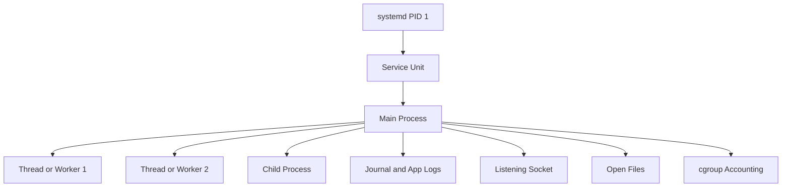
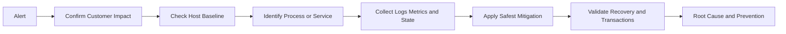

[🏠 Overview](README.md) · [🧠 Concepts](concepts.md) · [🧪 Lab](lab_guide.md) · [🚨 Troubleshooting](troubleshooting.md) · [🎯 Interview](interview_questions.md) · [📸 Evidence](screenshot_checklist.md)

---

# 🏗️ Linux Process & Service Architecture

## 🧱 Runtime Model

## 🚨 Incident Diagnosis Flow

## 🏦 Process Isolation Targets

| Workload | Isolation objective | Key evidence |
|---|---|---|
| payment API | predictable latency and graceful drain | CPU, RSS, connections, logs |
| ledger worker | no duplicate or partial posting | queue state, transactions, shutdown logs |
| audit forwarder | durable log delivery | service state, backlog, destination health |
| fraud engine | bounded resource use | throttling, memory, model latency |
| monitoring agent | low overhead and independent health | agent process and telemetry gaps |

> [!IMPORTANT]
> Restart policy is not a substitute for root-cause analysis. Crash loops can amplify load and hide persistent corruption or dependency failures.

---

**🏦 FinBank AI DevSecOps · Day 004 of 120**
*Learn · Build · Validate · Secure · Document · Improve*
