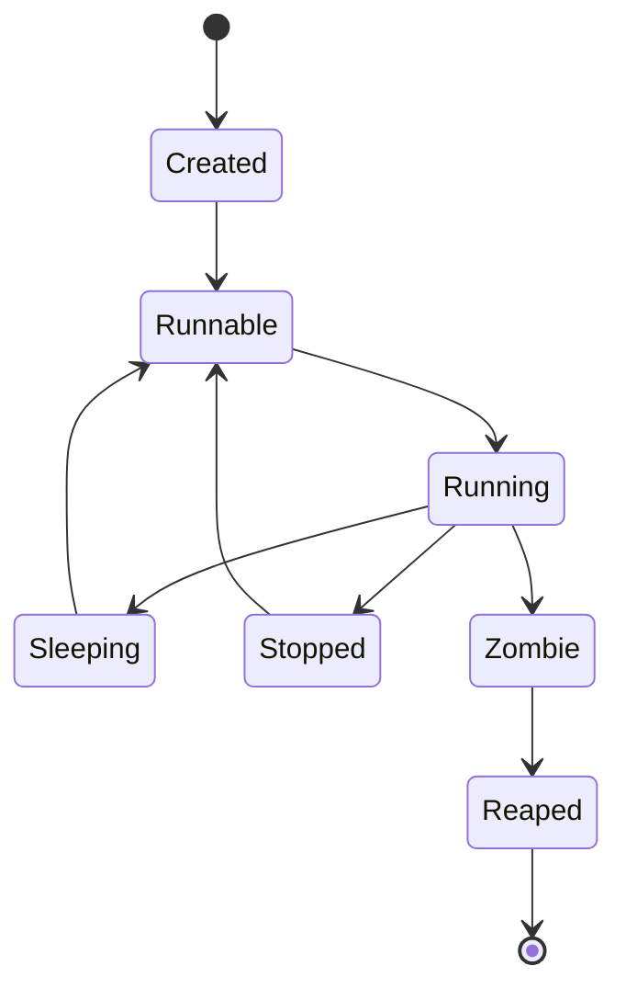

[🏠 Overview](README.md) · [🧠 Concepts](concepts.md) · [🧪 Lab](lab_guide.md) · [🚨 Troubleshooting](troubleshooting.md) · [🎯 Interview](interview_questions.md) · [📸 Evidence](screenshot_checklist.md)

---

# 🧠 Process, Service & Resource Concepts

## 🗺️ Concept Matrix

| Concept | Meaning | Production concern |
|---|---|---|
| process | running program with PID and resources | crash, leak, saturation |
| thread | execution path within a process | contention and deadlock |
| PPID | parent process identifier | ownership and lifecycle tracing |
| state | running, sleeping, stopped, zombie and more | blocked or unreaped work |
| signal | asynchronous process notification | unsafe termination |
| daemon | long-running background process | startup and supervision |
| systemd unit | declarative service/resource definition | dependency and restart behavior |
| load average | runnable and uninterruptible work average | backlog relative to CPU capacity |
| RSS | resident physical memory | pressure and OOM risk |
| VSZ | virtual address space | not equal to physical use |
| nice value | scheduling priority hint | fairness and starvation |
| cgroup | resource accounting and control hierarchy | isolation and limits |

## 🔄 Process Lifecycle

## 📡 Signals
SIGTERM requests graceful termination and permits cleanup. SIGKILL cannot be caught or ignored, so cleanup is impossible. Escalate only after confirming that graceful termination failed and impact is understood.

## 📊 Load, CPU and Memory
Load average is not CPU percentage. Compare load to available CPUs, then inspect runnable tasks, I/O waits and process-level evidence. Linux uses free memory for cache, so `available` memory is more useful than `free` alone.

## 👻 Zombie Processes
A zombie has exited but its parent has not collected status. Zombies consume process-table entries, not normal CPU. Diagnose the parent rather than killing the zombie, which is already dead.

## ⚙️ systemd
systemd PID 1 manages units, dependencies, targets, restart policies and lifecycle. A service can be inactive without being failed. Inspect `systemctl status`, unit definition and journal evidence together.

## 🧱 cgroups
cgroups account and optionally limit CPU, memory, process and I/O resources. Containers and modern service managers commonly use cgroups. Limits protect neighbors, but badly chosen limits can create throttling or OOM termination.

> [!TIP]
> Diagnose trends and correlated signals. A single snapshot can misrepresent transient CPU, cache use or short-lived processes.

---

**🏦 FinBank AI DevSecOps · Day 004 of 120**
*Learn · Build · Validate · Secure · Document · Improve*
