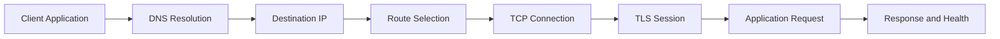

# 🌐 Day 005: Linux Networking, DNS & Connectivity Troubleshooting

### 🏦 FinBank AI DevSecOps · Foundation Phase · Day 5 of 120

🟢 **STATUS: READY** · 🔵 **PHASE: FOUNDATION** · 🟡 **PLATFORM: LINUX** · 🟣 **DOMAIN: BANKING** · 🤖 **AI: HUMAN-VALIDATED**

> A production-focused networking module covering interfaces, addressing, routes, DNS, TCP/UDP, sockets, HTTP diagnostics, local service testing, security exposure and evidence-driven incident response.

---

## 🧭 Quick Navigation

| Learn | Build | Validate | Prepare |
|---|---|---|---|
| [🧠 Concepts](concepts.md) | [🧪 Lab](lab_guide.md) | [✅ Testing](testing_strategy.md) | [🎯 Interview](interview_questions.md) |
| [⌨️ Commands](commands.md) | [🏗️ Architecture](architecture.md) | [🔐 Security](security_notes.md) | [🚨 Troubleshooting](troubleshooting.md) |
| [🏦 Banking](banking_relevance.md) | [🤖 AI Workflow](ai_assisted_workflow.md) | [📸 Evidence](screenshot_checklist.md) | [🏁 Summary](summary.md) |
| [💰 Cost](aws_cost_shutdown.md) | [📝 Notes](lab_notes.md) | [🌿 Git](git_workflow.md) | [🎨 Style](visual_style_guide.md) |

## 🎯 Learning Outcomes

- Explain interfaces, IPv4/IPv6, CIDR, gateways, routes and neighbor resolution.
- Distinguish DNS resolution from network reachability and application readiness.
- Explain TCP handshake, UDP behavior, ports, sockets and connection states.
- Use `ip`, `ss`, `resolvectl`, `getent`, `curl` and `/proc` safely.
- Start and verify a loopback-only HTTP service without exposing a public port.
- Diagnose route, DNS, connection-refused, timeout and readiness scenarios.
- Connect network controls to payment confidentiality, availability and segmentation.

## 📊 Completion Dashboard

| Workstream | Required evidence | Status |
|---|---|:---:|
| Interfaces | safe address inventory captured | ⬜ |
| Routing | default route and repository-host route understood | ⬜ |
| DNS | resolver configuration and name lookup validated | ⬜ |
| Sockets | listening and established state reviewed | ⬜ |
| HTTP | loopback-only endpoint tested | ⬜ |
| Failures | refused port and invalid DNS captured | ⬜ |
| Security | exposure and redaction review completed | ⬜ |
| Git | validated PR completed | ⬜ |

**Progress:** `Day 005 / 120` ▰▱▱▱▱▱▱▱▱▱

> [!IMPORTANT]
> Day 005 uses read-only host inspection and a loopback-only synthetic HTTP service. Do not modify routes, DNS, security groups, firewall rules or system network configuration.

## 🏗️ Request Resolution Flow

## 🏦 Banking Control Mapping

| Banking concern | Network control/signal | Operational value |
|---|---|---|
| confidentiality | TLS and restricted listeners | protects data in transit |
| availability | routes, DNS and health checks | detects connectivity failure |
| segmentation | private subnets and least-open ports | reduces blast radius |
| integrity | authenticated encrypted channels | resists tampering |
| auditability | connection and change evidence | supports investigation |

> [!CAUTION]
> Terminal output can contain private IP addresses and internal names. Screenshots and evidence must include only the minimum relevant information and must never expose secrets or real banking data.

## 📦 Enterprise Deliverables

- 17 premium GitHub-native documents
- Networking and troubleshooting Mermaid diagrams
- Four safe automation scripts
- Loopback-only HTTP connectivity lab
- Positive, negative and recovery tests
- Ten production troubleshooting scenarios
- Fifteen original senior-level interview questions
- Nine screenshot milestones
- Banking, AI, security, Git and AWS cost controls
