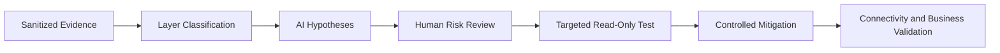

[🏠 Overview](README.md) · [🧠 Concepts](concepts.md) · [🧪 Lab](lab_guide.md) · [🚨 Troubleshooting](troubleshooting.md) · [🎯 Interview](interview_questions.md) · [📸 Evidence](screenshot_checklist.md)

---

# 🤖 AI-Assisted Network Diagnosis

## 🧩 Safe Prompt Contract
```text
Role: Senior Linux network and banking SRE
Context: Sanitized route, DNS, socket and curl timing evidence
Task: Rank connectivity hypotheses by layer
Constraints: Read-only first; no firewall/DNS/route changes; no secrets
Output: Layer, hypothesis, discriminator, risk, minimal mitigation and rollback
```

## ✅ Validation Pipeline


## 🚫 Reject Automatically
- Disabling TLS verification
- Opening all firewall ports
- Binding services publicly as a shortcut
- Flushing routes or DNS on a shared host
- Posting private topology or credentials
- Retrying payment operations without transaction-state validation

## 🧪 Day 005 Exercise
Use sanitized refused-port and invalid-DNS evidence. Ask AI to classify each failure by layer and verify the diagnosis against the known lab state.

---

**🏦 FinBank AI DevSecOps · Day 005 of 120**
*Learn · Build · Validate · Secure · Document · Improve*
