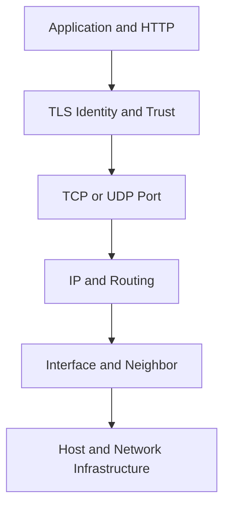
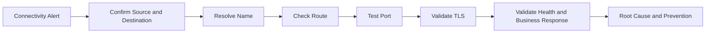

[🏠 Overview](README.md) · [🧠 Concepts](concepts.md) · [🧪 Lab](lab_guide.md) · [🚨 Troubleshooting](troubleshooting.md) · [🎯 Interview](interview_questions.md) · [📸 Evidence](screenshot_checklist.md)

---

# 🏗️ Network Architecture & Diagnostic Layers

## 🧱 Connectivity Layers

## 🚨 Diagnostic Flow

## 🏦 Banking Network Zones

| Zone | Typical workload | Design objective |
|---|---|---|
| edge | API gateway and WAF | controlled public ingress |
| application | payment services | private east-west communication |
| data | ledger and databases | tightly restricted access |
| operations | monitoring and deployment | attributable administration |
| audit | protected log pipeline | isolated append/forward path |

> [!IMPORTANT]
> Host-level checks are one part of the path. Cloud route tables, security groups, NACLs, load balancers, DNS, service mesh and application policy may also affect connectivity.

---

**🏦 FinBank AI DevSecOps · Day 005 of 120**
*Learn · Build · Validate · Secure · Document · Improve*
