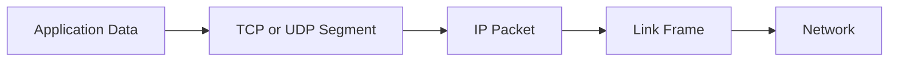

[🏠 Overview](README.md) · [🧠 Concepts](concepts.md) · [🧪 Lab](lab_guide.md) · [🚨 Troubleshooting](troubleshooting.md) · [🎯 Interview](interview_questions.md) · [📸 Evidence](screenshot_checklist.md)

---

# 🧠 Linux Networking Fundamentals

## 🗺️ Concept Matrix

| Concept | Meaning | Production risk |
|---|---|---|
| interface | network attachment visible to kernel | down or misconfigured link |
| IP address | logical endpoint address | collision or wrong subnet |
| CIDR | network prefix length | incorrect routing scope |
| route | destination-to-next-hop decision | blackhole or asymmetric path |
| DNS | name-to-record resolution | stale, failed or poisoned answer |
| socket | protocol endpoint represented by address and port | unintended exposure |
| TCP | connection-oriented byte stream | handshake, reset, backlog or retransmit issue |
| UDP | connectionless datagrams | loss, ordering and observability limits |
| loopback | host-local network path | safe local testing boundary |
| ephemeral port | temporary client-side source port | exhaustion under high concurrency |

## 📦 Encapsulation

## 🧭 Routing
The kernel chooses the most specific matching route, then considers metrics and policy routing. A default route is used only when no more specific route applies. `ip route get` is useful for the kernel's selected path without sending traffic.

## 🔎 DNS
DNS resolution is separate from transport connectivity. `getent hosts` follows the system name-service configuration. `resolvectl` exposes resolver status on systemd-resolved hosts. A DNS success does not prove that the target port or application is healthy.

## 🤝 TCP and UDP
TCP establishes state, ordering and retransmission. UDP is message-oriented and does not establish a connection. A TCP connection may succeed while the application returns an error. A listening port is not equivalent to readiness.

## 🧱 Socket States
`LISTEN` accepts new TCP connections. `ESTAB` is an established connection. `TIME-WAIT` protects old segments after close. Large counts require context such as traffic volume, timeout and ephemeral-port range.

## 🔐 TLS Layer
TLS identity, trust, protocol version and certificate validity are separate from DNS, routing and TCP. Diagnose from lower layers upward to avoid confusing a TLS error with network reachability.

> [!TIP]
> Troubleshoot in layers: local identity and interface → route → DNS → TCP/UDP → TLS → HTTP/application → dependency and business transaction.

---

**🏦 FinBank AI DevSecOps · Day 005 of 120**
*Learn · Build · Validate · Secure · Document · Improve*
