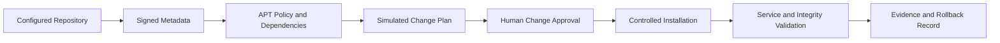

# 📦 Day 006: Linux Package Management & Enterprise Patching

### 🏦 FinBank AI DevSecOps · Foundation Phase · Day 6 of 120

🟢 **STATUS: READY** · 🔵 **PHASE: FOUNDATION** · 🟡 **PLATFORM: UBUNTU/APT** · 🟣 **DOMAIN: BANKING** · 🤖 **AI: HUMAN-VALIDATED**

> A read-only, production-oriented module for package inventory, repository trust, dependency awareness, update simulation, integrity verification, CVE/change governance and rollback planning.

---

## 🧭 Quick Navigation

| Learn | Build | Validate | Prepare |
|---|---|---|---|
| [🧠 Concepts](concepts.md) | [🧪 Lab](lab_guide.md) | [✅ Testing](testing_strategy.md) | [🎯 Interview](interview_questions.md) |
| [⌨️ Commands](commands.md) | [🏗️ Architecture](architecture.md) | [🔐 Security](security_notes.md) | [🚨 Troubleshooting](troubleshooting.md) |
| [🏦 Banking](banking_relevance.md) | [🤖 AI Workflow](ai_assisted_workflow.md) | [📸 Evidence](screenshot_checklist.md) | [🏁 Summary](summary.md) |
| [💰 Cost](aws_cost_shutdown.md) | [📝 Notes](lab_notes.md) | [🌿 Git](git_workflow.md) | [🎨 Style](visual_style_guide.md) |

## 🎯 Learning Outcomes

- Explain APT, dpkg, package metadata, repositories, signatures and dependency resolution.
- Inventory installed software without installing or upgrading packages.
- Inspect candidate versions and simulate an upgrade safely.
- Verify package-owned files and identify configuration drift indicators.
- Understand held packages, phased updates, service impact and reboot requirements.
- Build an auditable software inventory and patch-readiness report.
- Connect package lifecycle to banking change, vulnerability and rollback controls.

## 📊 Completion Dashboard

| Workstream | Evidence | Status |
|---|---|:---:|
| Platform | OS and package-tool versions captured | ⬜ |
| Inventory | installed packages summarized | ⬜ |
| Repositories | configured sources reviewed | ⬜ |
| Versions | installed/candidate versions inspected | ⬜ |
| Simulation | upgrade simulation recorded | ⬜ |
| Integrity | package verification demonstrated | ⬜ |
| Governance | patch and rollback plan documented | ⬜ |
| Git | validated PR completed | ⬜ |

**Progress:** `Day 006 / 120` ▰▱▱▱▱▱▱▱▱▱

> [!IMPORTANT]
> Day 006 is deliberately read-only. Do not run `apt upgrade`, `apt full-upgrade`, `apt autoremove`, `dpkg --configure -a`, repository changes or package installation on the shared learning EC2 host.

## 🏗️ Trusted Package Flow

## 🏦 Banking Control Mapping

| Banking requirement | Package control | Operational value |
|---|---|---|
| change governance | approved simulation and maintenance plan | lowers outage risk |
| software integrity | signed metadata and package verification | reduces tampering risk |
| vulnerability response | inventory and candidate tracking | supports remediation |
| availability | service-impact and rollback analysis | protects transactions |
| auditability | versions, evidence and approvals | supports investigation |

> [!CAUTION]
> A newer package is not automatically safe to deploy. Compatibility, configuration changes, service restart, database/client impact, rollback and transaction recovery must be assessed.

## 📦 Enterprise Deliverables

- 17 premium GitHub-native documents
- Four read-only package audit scripts
- Three governance templates
- Nine screenshot checkpoints
- Ten production troubleshooting scenarios
- Fifteen original senior-level interview questions
- Software inventory, repository review and simulated upgrade evidence
- Banking patch governance, AI validation, security and AWS cost controls
