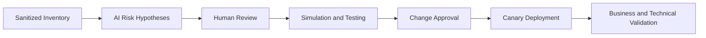

[🏠 Overview](README.md) · [🧠 Concepts](concepts.md) · [🧪 Lab](lab_guide.md) · [🚨 Troubleshooting](troubleshooting.md) · [🎯 Interview](interview_questions.md) · [📸 Evidence](screenshot_checklist.md)

---

# 🤖 AI-Assisted Patch Planning

## 🧩 Safe Prompt Contract
```text
Role: Senior Linux release and banking SRE
Context: Sanitized OS, installed/candidate versions and simulated plan
Task: Identify risks and test requirements
Constraints: No execution; no repository changes; no signature bypass
Output: Scope, dependencies, service impact, tests, rollback, stop criteria and evidence
```

## ✅ Validation Pipeline


## 🚫 Reject Automatically
- Bypassing signature checks
- Blind `-y` upgrades
- Adding arbitrary repositories
- Recommending unsupported downgrades
- Ignoring service restart or reboot impact
- Publishing internal repository credentials

## 🧪 Day 006 Exercise
Provide sanitized installed/candidate versions and simulation summary. Ask for a patch test matrix, then verify every recommendation against package evidence and application ownership.

---

**🏦 FinBank AI DevSecOps · Day 006 of 120**
*Learn · Build · Validate · Secure · Document · Improve*
