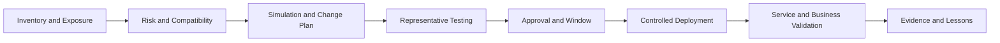
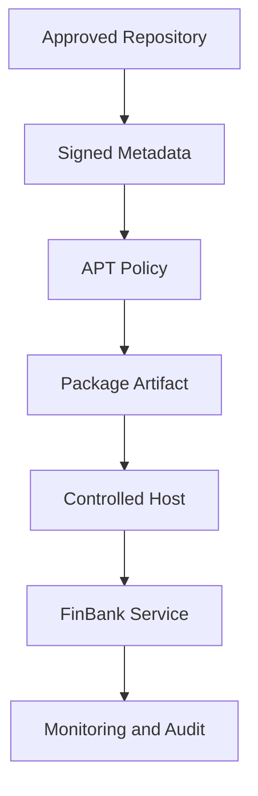

[🏠 Overview](README.md) · [🧠 Concepts](concepts.md) · [🧪 Lab](lab_guide.md) · [🚨 Troubleshooting](troubleshooting.md) · [🎯 Interview](interview_questions.md) · [📸 Evidence](screenshot_checklist.md)

---

# 🏗️ Enterprise Patch Lifecycle Architecture

## 🔄 Patch Lifecycle

## 🛡️ Supply-Chain Controls

## 🏦 Environment Progression

| Stage | Objective | Release gate |
|---|---|---|
| development | compatibility discovery | unit and integration tests |
| test | representative validation | service and migration checks |
| pre-production | production-like rehearsal | performance and rollback test |
| production canary | limited blast radius | health and business KPIs |
| production fleet | controlled rollout | approvals and stop criteria |

> [!IMPORTANT]
> Package patching must align with application releases, base-image ownership, infrastructure-as-code and immutable-delivery strategy. Avoid unexplained drift between hosts.

---

**🏦 FinBank AI DevSecOps · Day 006 of 120**
*Learn · Build · Validate · Secure · Document · Improve*
