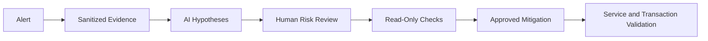

[🏠 Overview](README.md) · [🧠 Concepts](concepts.md) · [🧪 Lab](lab_guide.md) · [🚨 Troubleshooting](troubleshooting.md) · [🎯 Interview](interview_questions.md) · [📸 Evidence](screenshot_checklist.md)

---

# 🤖 AI-Assisted Service Diagnosis

## 🧩 Safe Prompt Contract
```text
Role: Senior Linux and banking SRE
Context: Sanitized status, unit properties and journal excerpts
Task: Rank service-failure hypotheses
Constraints: Read-only first; no restart/disable/mask; no secrets
Output: Hypothesis, evidence, impact, mitigation, rollback and business validation
```

## ✅ Validation Pipeline


## 🚫 Reject Automatically
- Restarting every service
- Disabling failed units to hide alerts
- Increasing timeouts without diagnosis
- Publishing secrets from journal output
- Using SIGKILL before graceful shutdown analysis
- Ignoring transaction reconciliation

---

**🏦 FinBank AI DevSecOps · Day 007 of 120**
*Learn · Build · Validate · Secure · Document · Improve*
