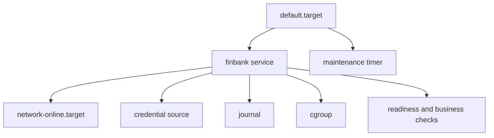
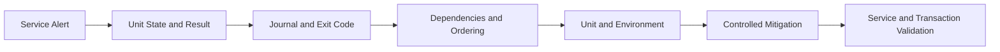

[🏠 Overview](README.md) · [🧠 Concepts](concepts.md) · [🧪 Lab](lab_guide.md) · [🚨 Troubleshooting](troubleshooting.md) · [🎯 Interview](interview_questions.md) · [📸 Evidence](screenshot_checklist.md)

---

# 🏗️ systemd Reliability Architecture

## 🧱 Unit Relationship Model

## 🚨 Diagnosis Flow

## 🏦 Reliability Layers

| Layer | Control | Evidence |
|---|---|---|
| process | identity, limits, graceful signals | PID and exit result |
| service | dependencies, timeout, restart | unit properties |
| application | health and readiness | application response |
| business | payment/ledger outcome | reconciliation and KPIs |
| platform | redundancy and rollout | deployment evidence |

> [!IMPORTANT]
> A service can be `active` while its business function is degraded. Combine unit state with application and transaction health.

---

**🏦 FinBank AI DevSecOps · Day 007 of 120**
*Learn · Build · Validate · Secure · Document · Improve*
