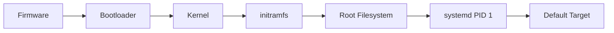

[🏠 Overview](README.md) · [🧠 Concepts](concepts.md) · [🧪 Lab](lab_guide.md) · [🚨 Troubleshooting](troubleshooting.md) · [🎯 Interview](interview_questions.md) · [📸 Evidence](screenshot_checklist.md)

---

# 🧠 systemd & Boot Concepts

## 🗺️ Concept Matrix

| Concept | Meaning | Production risk |
|---|---|---|
| PID 1 | first userspace process and service manager | host-wide lifecycle failure |
| unit | declarative systemd object | incorrect dependencies or policy |
| target | synchronization group of units | wrong boot state |
| enablement | install-time boot linkage | unexpected startup behavior |
| active state | current runtime condition | confused with enablement |
| dependency | requirement, ordering or relationship | race or cascade failure |
| journal | structured service/boot logs | missing evidence or retention gap |
| restart policy | automated recovery behavior | crash-loop amplification |
| timeout | bounded start/stop window | forced termination or hanging boot |
| transient unit | runtime-created unit | safe temporary testing |

## 🚀 Boot Path

## ⚙️ Unit Types
Service, socket, timer, path, mount, automount, target, device and scope units model different resources. Socket activation can start a service on demand. Timers provide calendar or monotonic scheduling.

## 🔗 Dependencies and Ordering
`Requires` and `Wants` describe requirement strength. `After` and `Before` control ordering, not requirement. Combining these incorrectly creates boot races or unnecessary failure propagation.

## 🧾 Journald
The journal records structured metadata such as unit, PID, priority, boot ID and timestamps. Retention can be volatile or persistent. Log presence does not replace application-level audit guarantees.

## ♻️ Restart Policies
Restart policies must reflect failure semantics. Automatic restart can improve availability but may amplify dependency load or repeat unsafe transaction work. Use rate limits and stop criteria.

> [!TIP]
> Diagnose state, exit result, dependency ordering, journal and exact unit definition together. `active` alone is incomplete evidence.

---

**🏦 FinBank AI DevSecOps · Day 007 of 120**
*Learn · Build · Validate · Secure · Document · Improve*
