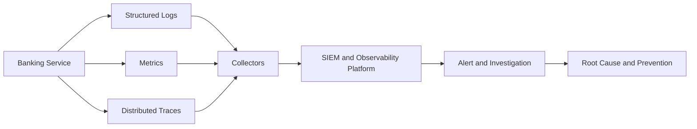

# 📊 Day 008: Linux Logging, Observability & Incident Diagnostics

### 🏦 FinBank AI DevSecOps · Foundation Phase · Day 8 of 120

🟢 **STATUS: READY** · 🔵 **PHASE: FOUNDATION** · 🟡 **PLATFORM: JOURNALD/RSYSLOG** · 🟣 **DOMAIN: BANKING** · 🤖 **AI: HUMAN-VALIDATED**

> A production-focused module for journal analysis, syslog facilities and priorities, safe synthetic event generation, retention, log rotation, incident timelines, audit evidence and observability design.

---

## 🧭 Quick Navigation

| Learn | Build | Validate | Prepare |
|---|---|---|---|
| [🧠 Concepts](concepts.md) | [🧪 Lab](lab_guide.md) | [✅ Testing](testing_strategy.md) | [🎯 Interview](interview_questions.md) |
| [⌨️ Commands](commands.md) | [🏗️ Architecture](architecture.md) | [🔐 Security](security_notes.md) | [🚨 Troubleshooting](troubleshooting.md) |
| [🏦 Banking](banking_relevance.md) | [🤖 AI Workflow](ai_assisted_workflow.md) | [📸 Evidence](screenshot_checklist.md) | [🏁 Summary](summary.md) |
| [💰 Cost](aws_cost_shutdown.md) | [📝 Notes](lab_notes.md) | [🌿 Git](git_workflow.md) | [🎨 Style](visual_style_guide.md) |

## 🎯 Learning Outcomes

- Explain journald, rsyslog, facilities, priorities, structured fields and boot IDs.
- Filter logs by unit, boot, time, priority, PID and custom identifier.
- Compare logs, metrics and traces and understand correlation identifiers.
- Inspect retention, journal disk use and logrotate configuration safely.
- Generate synthetic INFO, WARNING and ERROR events without real customer data.
- Build an incident timeline and distinguish symptom, cause and business impact.
- Connect audit logging to payment integrity, non-repudiation and SIEM workflows.

## 📊 Completion Dashboard

| Workstream | Required evidence | Status |
|---|---|:---:|
| Platform | journald and rsyslog state reviewed | ⬜ |
| System logs | boot and service events inspected | ⬜ |
| Filtering | priority/unit/identifier queries tested | ⬜ |
| Retention | disk use and rotation controls reviewed | ⬜ |
| Synthetic logs | safe banking-style events generated | ⬜ |
| Analysis | event counts and timeline produced | ⬜ |
| Security | secrets/PII controls validated | ⬜ |
| Git | reviewed PR merged | ⬜ |

**Progress:** `Day 008 / 120` ▰▱▱▱▱▱▱▱▱▱

> [!IMPORTANT]
> All generated events are synthetic and tagged `finbank-day008`. Do not log credentials, tokens, account numbers, customer names, payment payloads or private keys.

## 🏗️ Observability Signal Flow

## 🏦 Banking Control Mapping

| Banking concern | Logging control | Operational value |
|---|---|---|
| payment availability | service and dependency events | faster diagnosis |
| transaction integrity | correlation and outcome fields | safer reconciliation |
| auditability | immutable centralized audit trail | investigation support |
| confidentiality | redaction and least-access | prevents data exposure |
| compliance | retention and access governance | evidence lifecycle |

## 📦 Enterprise Deliverables

- 17 premium GitHub-native documents
- Four executable scripts
- Three incident/audit templates
- Nine screenshot checkpoints
- Ten production troubleshooting scenarios
- Fifteen senior interview questions
- Banking incident, SIEM, AI and AWS cost-control guidance
