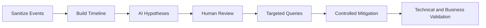

[🏠 Overview](README.md) · [🧠 Concepts](concepts.md) · [🧪 Lab](lab_guide.md) · [🚨 Troubleshooting](troubleshooting.md) · [🎯 Interview](interview_questions.md) · [📸 Evidence](screenshot_checklist.md)

---

# 🤖 AI-Assisted Log Investigation

## 🧩 Safe Prompt Contract
```text
Role: Senior banking SRE and incident analyst
Context: Sanitized event timeline and service metadata
Task: Rank root-cause hypotheses and missing evidence
Constraints: No secrets, no customer data, no destructive commands
Output: Hypothesis, evidence, impact, discriminator, mitigation and validation
```

## ✅ Validation Pipeline


## 🚫 Reject Automatically
- Uploading raw production logs with sensitive data
- Deleting or vacuuming evidence
- Treating frequency as proof of cause
- Restarting services before preserving evidence
- Blindly retrying uncertain payments
- Inventing missing events or timestamps

---

**🏦 FinBank AI DevSecOps · Day 008 of 120**
*Learn · Build · Validate · Secure · Document · Improve*
