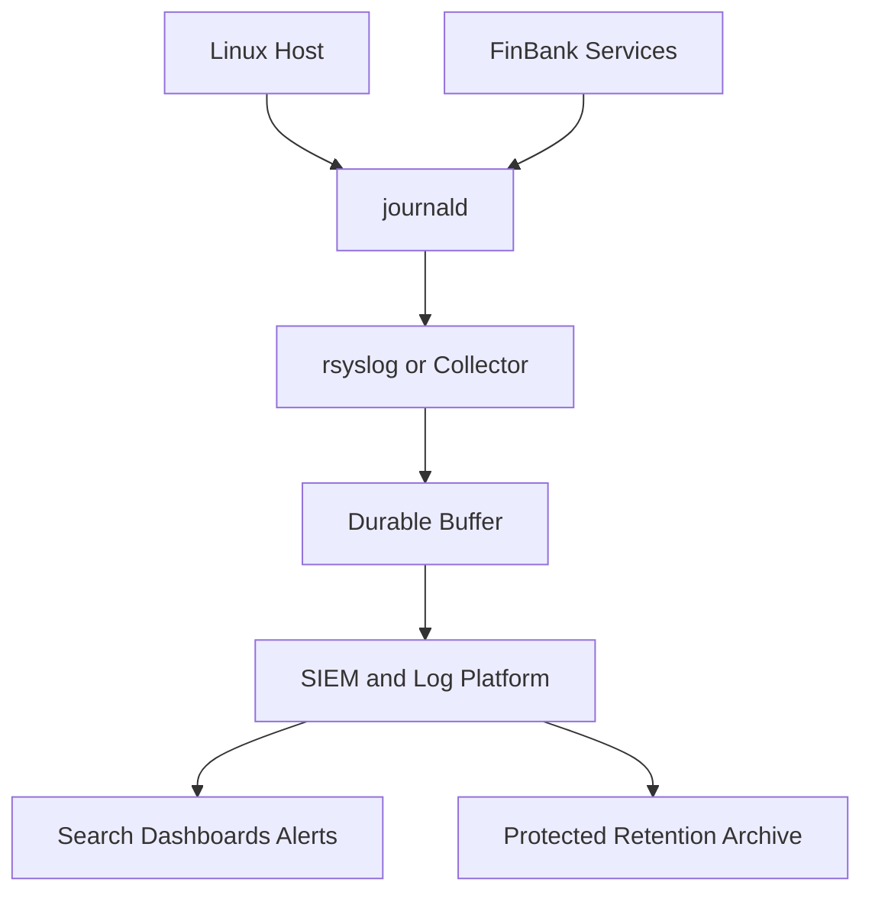
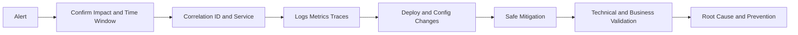

[🏠 Overview](README.md) · [🧠 Concepts](concepts.md) · [🧪 Lab](lab_guide.md) · [🚨 Troubleshooting](troubleshooting.md) · [🎯 Interview](interview_questions.md) · [📸 Evidence](screenshot_checklist.md)

---

# 🏗️ Enterprise Observability Architecture

## 🧱 Collection Architecture

## 🚨 Incident Investigation Flow

## 🏦 Evidence Domains

| Domain | Examples | Protection |
|---|---|---|
| application | errors, outcomes, latency context | redaction and access control |
| security | authentication, privilege, policy | centralized protected storage |
| infrastructure | boot, kernel, resource events | host and cloud correlation |
| audit | actor, action, object, outcome | immutability and retention |
| business | payment status and reconciliation ID | strict data minimization |

> [!IMPORTANT]
> Application logs are not a substitute for a dedicated audit ledger. Audit evidence requires stronger integrity, access and retention controls.

---

**🏦 FinBank AI DevSecOps · Day 008 of 120**
*Learn · Build · Validate · Secure · Document · Improve*
