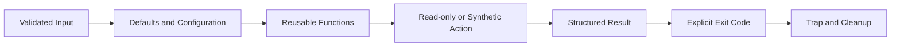

# 🐚 Day 009: Production Bash Scripting & Banking Automation

### 🏦 FinBank AI DevSecOps · Foundation Phase · Day 9 of 120

🟢 **STATUS: READY** · 🔵 **PHASE: FOUNDATION** · 🟡 **PLATFORM: BASH** · 🟣 **DOMAIN: BANKING** · 🤖 **AI: HUMAN-VALIDATED**

> An enterprise-grade shell scripting module covering strict mode, variables, validation, conditions, loops, functions, arrays, exit codes, traps, safe file handling, testability, logging and production automation patterns.

---

## 🧭 Quick Navigation

| Learn | Build | Validate | Prepare |
|---|---|---|---|
| [🧠 Concepts](concepts.md) | [🧪 Lab](lab_guide.md) | [✅ Testing](testing_strategy.md) | [🎯 Interview](interview_questions.md) |
| [⌨️ Commands](commands.md) | [🏗️ Architecture](architecture.md) | [🔐 Security](security_notes.md) | [🚨 Troubleshooting](troubleshooting.md) |
| [🏦 Banking](banking_relevance.md) | [🤖 AI Workflow](ai_assisted_workflow.md) | [📸 Evidence](screenshot_checklist.md) | [🏁 Summary](summary.md) |
| [💰 Cost](aws_cost_shutdown.md) | [📝 Notes](lab_notes.md) | [🌿 Git](git_workflow.md) | [🎨 Style](visual_style_guide.md) |

## 🎯 Learning Outcomes

- Use shebangs, strict mode, quoting, parameters, arrays, conditions, loops and functions correctly.
- Design predictable exit codes, traps, temporary directories and cleanup behavior.
- Validate user input and prevent globbing, word-splitting and command-injection defects.
- Build safe service checks, synthetic log parsing and backup-manifest simulation.
- Add structured script logs, usage help, dry-run behavior and testable outputs.
- Apply shell automation to reconciliation, health checks, evidence collection and audit workflows.

## 📊 Completion Dashboard

| Workstream | Evidence | Status |
|---|---|:---:|
| Syntax | all scripts pass `bash -n` | ⬜ |
| Inputs | valid and invalid parameters tested | ⬜ |
| Logic | conditions, loops and arrays demonstrated | ⬜ |
| Modularity | reusable functions validated | ⬜ |
| Health | service checker report generated | ⬜ |
| Parsing | synthetic log summary generated | ⬜ |
| Failure | controlled exit code and cleanup proven | ⬜ |
| Git | reviewed PR merged | ⬜ |

**Progress:** `Day 009 / 120` ▰▱▱▱▱▱▱▱▱▱

> [!IMPORTANT]
> Every Day009 script is repository-local, read-only toward system services, and uses synthetic data. No real backups, customer data, package changes or service restarts occur.

## 🏗️ Script Execution Flow

## 🏦 Banking Control Mapping

| Banking concern | Scripting control | Outcome |
|---|---|---|
| transaction integrity | validation and idempotency | avoids unsafe duplicate action |
| availability | bounded checks and timeouts | prevents hanging automation |
| auditability | timestamps, correlation and exit codes | reproducible evidence |
| confidentiality | no secrets in arguments/logs | reduces exposure |
| change safety | dry-run and explicit scope | controlled execution |

## 📦 Enterprise Deliverables

- 17 premium GitHub-native documents
- Four executable production-style scripts
- Three reusable operations templates
- Nine exact screenshots
- Fifteen senior interview questions
- Ten real-world troubleshooting scenarios
- Banking automation, AI, security, testing, Git and cost controls
