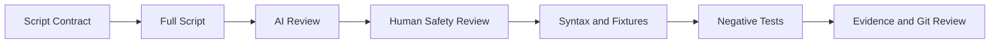

[🏠 Overview](README.md) · [🧠 Concepts](concepts.md) · [🧪 Lab](lab_guide.md) · [🚨 Troubleshooting](troubleshooting.md) · [🎯 Interview](interview_questions.md) · [📸 Evidence](screenshot_checklist.md)

---

# 🤖 AI-Assisted Script Review

## 🧩 Safe Prompt Contract
```text
Role: Senior Bash and banking automation reviewer
Context: Script with synthetic fixtures and explicit safety boundary
Task: Identify correctness, security, portability and test gaps
Constraints: No secrets; no destructive changes; no invented environment assumptions
Output: Finding, evidence, risk, corrected full-file recommendation and test
```

## ✅ Review Pipeline


## 🚫 Reject Automatically
- Unquoted variables in path-changing commands
- `eval` with external input
- Hardcoded credentials
- Unbounded loops or retries
- Blind service restart or payment replay
- Partial snippets that omit cleanup/error behavior

---

**🏦 FinBank AI DevSecOps · Day 009 of 120**
*Learn · Build · Validate · Secure · Document · Improve*
