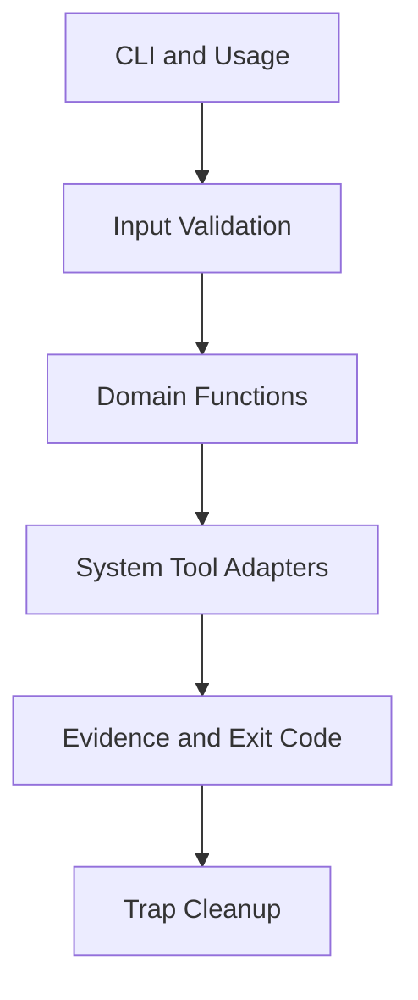
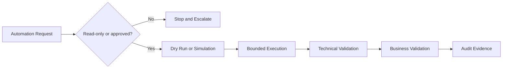

[🏠 Overview](README.md) · [🧠 Concepts](concepts.md) · [🧪 Lab](lab_guide.md) · [🚨 Troubleshooting](troubleshooting.md) · [🎯 Interview](interview_questions.md) · [📸 Evidence](screenshot_checklist.md)

---

# 🏗️ Automation Architecture

## 🧱 Layered Script Design

## 🚨 Automation Decision Flow

## 🏦 Script Boundaries

| Script | Reads | Writes | Deliberate restriction |
|---|---|---|---|
| backup manifest | synthetic source tree | manifest only | no archive or deletion |
| service checker | service state | report only | no restart/stop |
| log parser | synthetic log | summary only | no production logs |
| validator | repository evidence | terminal result | no system mutation |

> [!IMPORTANT]
> Bash automation must have an explicit privilege boundary. A script that can restart services, delete data or replay transactions requires separate approval and stronger controls.

---

**🏦 FinBank AI DevSecOps · Day 009 of 120**
*Learn · Build · Validate · Secure · Document · Improve*
