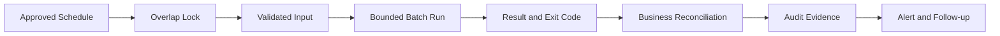

# ⏱️ Day 010: Linux Automation, Scheduling & Banking Batch Reliability

### 🏦 FinBank AI DevSecOps · Foundation Phase · Day 10 of 120

🟢 **STATUS: READY** · 🔵 **PHASE: FOUNDATION** · 🟡 **PLATFORM: CRON/SYSTEMD TIMERS** · 🟣 **DOMAIN: BANKING** · 🤖 **AI: HUMAN-VALIDATED**

> An enterprise-grade module for cron expressions, systemd timers, one-time jobs, locking, idempotency, missed-run behavior, batch evidence, retry safety and production scheduling governance.

---

## 🧭 Quick Navigation

| Learn | Build | Validate | Prepare |
|---|---|---|---|
| [🧠 Concepts](concepts.md) | [🧪 Lab](lab_guide.md) | [✅ Testing](testing_strategy.md) | [🎯 Interview](interview_questions.md) |
| [⌨️ Commands](commands.md) | [🏗️ Architecture](architecture.md) | [🔐 Security](security_notes.md) | [🚨 Troubleshooting](troubleshooting.md) |
| [🏦 Banking](banking_relevance.md) | [🤖 AI Workflow](ai_assisted_workflow.md) | [📸 Evidence](screenshot_checklist.md) | [🏁 Summary](summary.md) |
| [💰 Cost](aws_cost_shutdown.md) | [📝 Notes](lab_notes.md) | [🌿 Git](git_workflow.md) | [🎨 Style](visual_style_guide.md) |

## 🎯 Learning Outcomes

- Read and validate cron schedules without installing real recurring jobs.
- Compare cron, `at`, systemd timers and external schedulers.
- Design bounded batch jobs with locks, idempotency and explicit exit codes.
- Generate scheduled-style reports using synthetic transaction data.
- Detect overlap, stale locks, missed runs and unsafe retries.
- Build auditable banking batch evidence and reconciliation controls.

## 📊 Completion Dashboard

| Workstream | Evidence | Status |
|---|---|:---:|
| Platform | cron/timer state inspected | ⬜ |
| Schedule | cron expressions validated | ⬜ |
| Report | synthetic batch report generated | ⬜ |
| Locking | overlap prevention demonstrated | ⬜ |
| Failure | controlled invalid input captured | ⬜ |
| Audit | run ID and manifest recorded | ⬜ |
| Validation | all scripts and artifacts pass | ⬜ |
| Git | reviewed PR merged | ⬜ |

**Progress:** `Day 010 / 120` ▰▱▱▱▱▱▱▱▱▱

> [!IMPORTANT]
> Day010 does not install a crontab, create a system timer, submit an `at` job, restart cron, or modify AWS resources. All scheduling is simulated with repository-local synthetic data.

## 🏗️ Reliable Batch Flow

## 🏦 Banking Control Mapping

| Concern | Scheduling control | Outcome |
|---|---|---|
| duplicate settlement | locks and idempotency keys | prevents repeated effects |
| missed reconciliation | run ledger and missed-run alert | visible gap |
| partial failure | checkpoints and explicit status | safe recovery |
| auditability | run ID, schedule, inputs, outputs | reproducible evidence |
| confidentiality | synthetic/minimized logs | lower exposure |

## 📦 Enterprise Deliverables

- 17 premium GitHub-native documents
- Four executable automation scripts
- Three batch-governance templates
- Nine exact screenshot checkpoints
- Fifteen senior interview questions
- Ten production troubleshooting scenarios
- Banking controls, AI review, security, testing, Git and cost guidance
