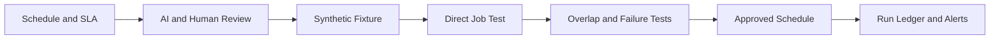

[🏠 Overview](README.md) · [🧠 Concepts](concepts.md) · [🧪 Lab](lab_guide.md) · [🚨 Troubleshooting](troubleshooting.md) · [🎯 Interview](interview_questions.md) · [📸 Evidence](screenshot_checklist.md)

---

# 🤖 AI-Assisted Schedule Review

## 🧩 Safe Prompt Contract
```text
Role: Senior Linux batch and banking SRE
Context: Schedule, synthetic job contract, run ledger and failure policy
Task: Review correctness, overlap, retry, security and observability
Constraints: Do not install schedules or infer production state
Output: Finding, risk, test, mitigation, rollback and business validation
```

## ✅ Review Pipeline


## 🚫 Reject Automatically
- Blind retries of uncertain transactions
- Schedules with secret-bearing command lines
- No overlap protection
- Unbounded runtime or retry loops
- Installing a scheduler entry without review
- Treating exit zero as business success

---

**🏦 FinBank AI DevSecOps · Day 010 of 120**
*Learn · Build · Validate · Secure · Document · Improve*
