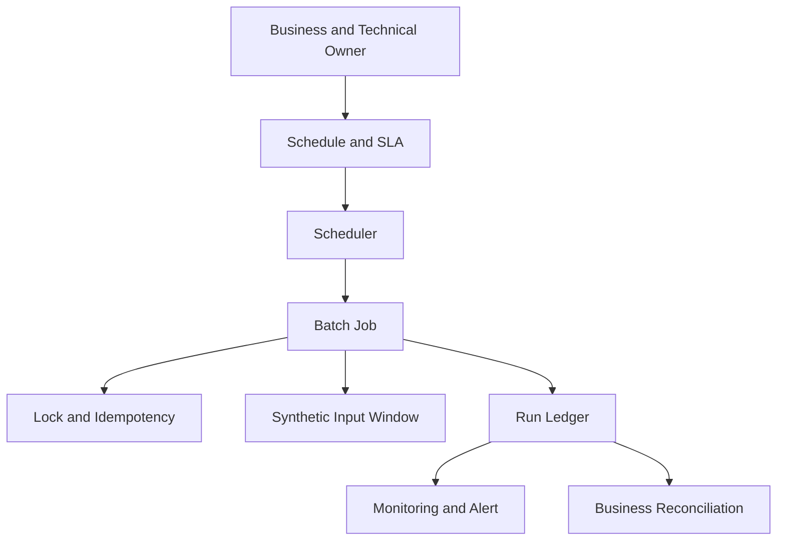
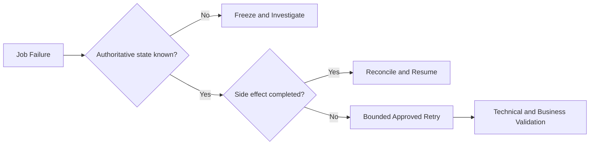

[🏠 Overview](README.md) · [🧠 Concepts](concepts.md) · [🧪 Lab](lab_guide.md) · [🚨 Troubleshooting](troubleshooting.md) · [🎯 Interview](interview_questions.md) · [📸 Evidence](screenshot_checklist.md)

---

# 🏗️ Batch Automation Architecture

## 🧱 Control Plane and Run Plane

## 🚨 Recovery Decision

## 🏦 Batch Boundaries

| Component | Responsibility | Evidence |
|---|---|---|
| scheduler | trigger | expected and actual run time |
| job | bounded processing | exit code and counts |
| lock | prevent overlap | acquisition/release result |
| checkpoint | resume boundary | durable offset/window |
| reconciliation | business correctness | matched totals/outcomes |

> [!IMPORTANT]
> A successful process exit does not prove successful settlement or reconciliation. Validate authoritative business outcomes.

---

**🏦 FinBank AI DevSecOps · Day 010 of 120**
*Learn · Build · Validate · Secure · Document · Improve*
