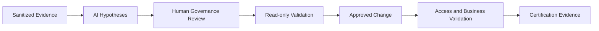

[🏠 Overview](README.md) · [🧠 Concepts](concepts.md) · [🧪 Lab](lab_guide.md) · [🚨 Troubleshooting](troubleshooting.md) · [🎯 Interview](interview_questions.md) · [📸 Evidence](screenshot_checklist.md)

---

# 🤖 AI-Assisted Administration Review

## 🧩 Safe Prompt Contract
```text
Role: Senior Linux security and banking SRE
Context: Sanitized identity, sudo, limits, capacity and service evidence
Task: Identify governance gaps and read-only discriminators
Constraints: No employee profiling, secrets or policy changes
Output: Finding, evidence, risk, safe test, remediation and rollback
```

## ✅ Review Pipeline


## 🚫 Reject Automatically
- Granting broad sudo as a shortcut
- Editing PAM remotely without recovery
- Publishing identities or privilege mappings
- Raising limits without root-cause analysis
- Deleting accounts before ownership review
- Inferring employee intent or performance from logs

---

**🏦 FinBank AI DevSecOps · Day 011 of 120**
*Learn · Audit · Validate · Secure · Document · Improve*
