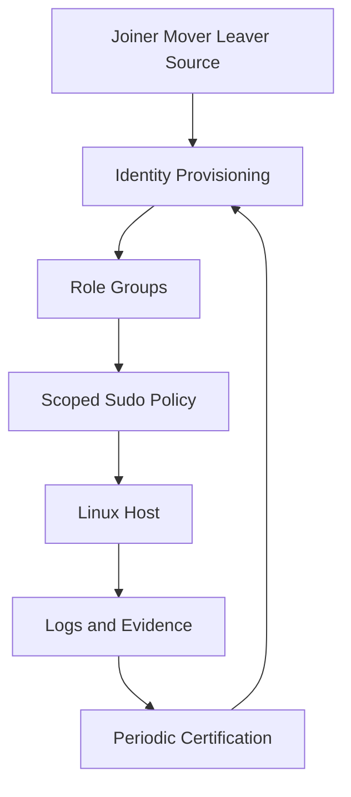
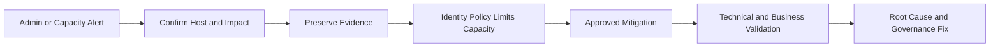

[🏠 Overview](README.md) · [🧠 Concepts](concepts.md) · [🧪 Lab](lab_guide.md) · [🚨 Troubleshooting](troubleshooting.md) · [🎯 Interview](interview_questions.md) · [📸 Evidence](screenshot_checklist.md)

---

# 🏗️ Linux Administration Governance Architecture

## 🧱 Governance Layers

## 🚨 Administrative Incident Flow

## 🏦 Control Domains

| Domain | Key controls | Evidence |
|---|---|---|
| identity | named accounts, owner, expiry | account inventory |
| privilege | command-scoped sudo | effective policy review |
| resource | limits, quotas, capacity | baseline/report |
| service | owner, state, dependency | service inventory |
| audit | centralized attributable logs | reviewed audit trail |

> [!IMPORTANT]
> Break-glass access requires separate credentials, restricted use, monitoring, post-use rotation and formal review.

---

**🏦 FinBank AI DevSecOps · Day 011 of 120**
*Learn · Audit · Validate · Secure · Document · Improve*
