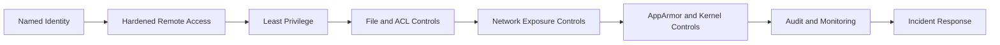

# 🔐 Day 012: Linux Security Hardening & Banking Host Defense

### 🏦 FinBank AI DevSecOps · Security Foundation · Day 12 of 120

🟢 **STATUS: READY** · 🔵 **MODE: READ-ONLY AUDIT** · 🟡 **PLATFORM: UBUNTU** · 🟣 **DOMAIN: BANKING**

> A production-oriented host-hardening module covering SSH governance, permissions, ACLs, exposed services, firewall state, kernel controls, mandatory access controls, secrets hygiene, audit evidence and controlled remediation planning.

## 🧭 Navigation

| Learn | Practice | Govern | Prepare |
|---|---|---|---|
| [Concepts](concepts.md) | [Lab](lab_guide.md) | [Security](security_notes.md) | [Interview](interview_questions.md) |
| [Commands](commands.md) | [Testing](testing_strategy.md) | [Banking](banking_relevance.md) | [Troubleshooting](troubleshooting.md) |
| [Architecture](architecture.md) | [Evidence](screenshot_checklist.md) | [Git](git_workflow.md) | [Summary](summary.md) |

## 🎯 Outcomes
- Audit SSH effective configuration without changing access.
- Find risky writable files, SUID/SGID executables and ACLs within safe scope.
- Review listening sockets, firewall state and exposed interfaces.
- Inspect AppArmor, kernel security controls and update posture.
- Produce sanitized security reports and a prioritized hardening backlog.
- Connect host controls to payment confidentiality, integrity and availability.

## 📊 Dashboard
| Control | Evidence | Status |
|---|---|:---:|
| Repository isolation | root, branch, origin | ⬜ |
| SSH governance | effective settings | ⬜ |
| File security | modes, SUID/SGID, ACL | ⬜ |
| Exposure | listeners and firewall | ⬜ |
| Host defenses | AppArmor and sysctl | ⬜ |
| Reports | three sanitized artifacts | ⬜ |
| Failure test | exit 64 | ⬜ |
| Git quality | validator and PR | ⬜ |

> [!IMPORTANT]
> Day012 is audit-only. Do not edit SSH, firewall, sysctl, AppArmor, permissions, ACLs, users, services or packages.

## 🏗️ Defense-in-Depth

## 📦 Deliverables
17 authored documents, four scripts, three governance templates, nine screenshots, fifteen senior interview questions, ten production troubleshooting cases, banking controls, Git workflow and AWS shutdown checklist.
