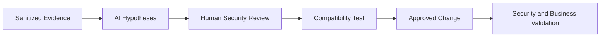

[🏠 Overview](README.md) · [🧠 Concepts](concepts.md) · [🧪 Lab](lab_guide.md) · [🚨 Troubleshooting](troubleshooting.md) · [🎯 Interview](interview_questions.md) · [📸 Evidence](screenshot_checklist.md)

---

# 🤖 AI-Assisted Hardening Review

## Safe Prompt
```text
Role: Senior Linux security and banking SRE
Context: Sanitized host-security evidence
Task: Prioritize findings and propose read-only validation
Constraints: No secrets, no destructive commands, no access-changing actions
Output: Finding, evidence, risk, discriminator, remediation, rollback and business validation
```
## Pipeline

## Reject
Broadly disabling controls, blocking SSH without recovery, deleting binaries without provenance, publishing sensitive evidence, or treating benchmark score as business risk proof.

---

**🏦 FinBank AI DevSecOps · Day 012 of 120**
*Learn · Audit · Harden · Validate · Document · Improve*
