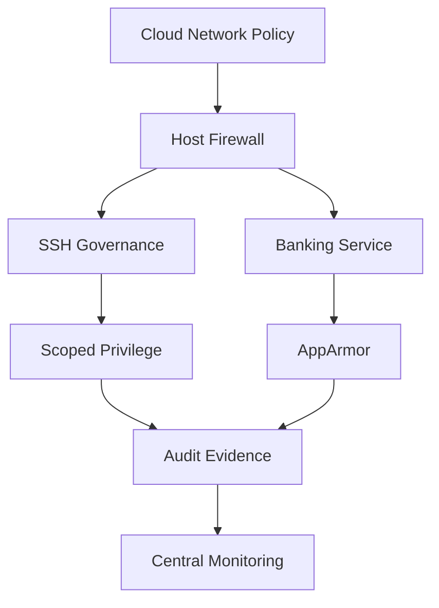
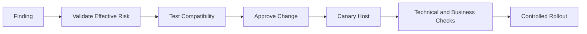

[🏠 Overview](README.md) · [🧠 Concepts](concepts.md) · [🧪 Lab](lab_guide.md) · [🚨 Troubleshooting](troubleshooting.md) · [🎯 Interview](interview_questions.md) · [📸 Evidence](screenshot_checklist.md)

---

# 🏗️ Banking Host Defense Architecture

## Layered Controls

## Hardening Change Flow

## Principles
- Preserve remote recovery before SSH/firewall changes.
- Test application behavior before permission or MAC changes.
- Validate payment, ledger and audit paths after hardening.
- Record exceptions with owner and expiry.

---

**🏦 FinBank AI DevSecOps · Day 012 of 120**
*Learn · Audit · Harden · Validate · Document · Improve*
