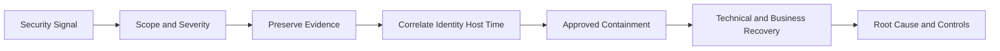

# 🔎 Day 013: Linux Auditing, Threat Detection & Incident Readiness

### 🏦 FinBank AI DevSecOps · Security Operations Phase · Day 13 of 120

🟢 **STATUS: READY** · 🔵 **MODE: READ-ONLY INVESTIGATION** · 🟡 **PLATFORM: JOURNAL/AUDIT** · 🟣 **DOMAIN: BANKING**

> An enterprise security-operations module for login review, privileged-event analysis, process evidence, log integrity, timelines, incident triage, audit readiness, evidence preservation and banking threat-detection workflows.

## 🧭 Quick Navigation

| Learn | Practice | Govern | Prepare |
|---|---|---|---|
| [Concepts](concepts.md) | [Lab](lab_guide.md) | [Security](security_notes.md) | [Interview](interview_questions.md) |
| [Commands](commands.md) | [Testing](testing_strategy.md) | [Banking](banking_relevance.md) | [Troubleshooting](troubleshooting.md) |
| [Architecture](architecture.md) | [Evidence](screenshot_checklist.md) | [Git](git_workflow.md) | [Summary](summary.md) |

## 🎯 Learning Outcomes
- Distinguish audit, operational and security evidence.
- Review successful/failed login and sudo events safely.
- Build bounded journal queries by boot, time, unit and priority.
- Inspect process and executable evidence without profiling people.
- Generate integrity hashes for synthetic evidence.
- Construct an incident timeline and preserve chain-of-custody metadata.
- Relate host telemetry to banking fraud, payment and compliance operations.

## 📊 Completion Dashboard
| Workstream | Evidence | Status |
|---|---|:---:|
| Repository | branch and origin | ⬜ |
| Login audit | bounded login evidence | ⬜ |
| Privileged events | sudo/admin review | ⬜ |
| Process evidence | current process baseline | ⬜ |
| Integrity | synthetic log hashes | ⬜ |
| Incident timeline | correlated events | ⬜ |
| Validation | scripts and secrets clean | ⬜ |
| Git | PR merged | ⬜ |

> [!IMPORTANT]
> Use bounded, sanitized evidence only. Do not commit raw authentication logs, IP inventories, usernames, command histories, keys, tokens or customer data.

## 🏗️ Detection and Response Flow

## 🏦 Banking Control Mapping
| Concern | Audit control | Value |
|---|---|---|
| privileged misuse | named sudo evidence | attribution |
| account attack | login failure trends | early detection |
| payment incident | correlated host/service events | timeline |
| evidence integrity | hashes and custody record | investigation confidence |
| compliance | retention and review | audit readiness |

## 📦 Deliverables
17 authored documents, four read-only scripts, three incident templates, nine screenshots, fifteen senior interview questions, ten production scenarios, banking controls, testing, Git and cost guidance.
