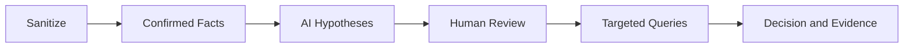

[🏠 Overview](README.md) · [🧠 Concepts](concepts.md) · [🧪 Lab](lab_guide.md) · [🚨 Troubleshooting](troubleshooting.md) · [🎯 Interview](interview_questions.md) · [📸 Evidence](screenshot_checklist.md)

---

# 🤖 AI-Assisted Incident Analysis

## Safe Prompt
```text
Role: Senior banking SOC and Linux SRE
Context: Sanitized timeline and technical metadata
Task: Rank hypotheses and missing discriminators
Constraints: No identities, secrets, blame, destructive steps or invented evidence
Output: Confirmed facts, hypotheses, confidence, safe query, containment risk and business validation
```
## Workflow

Reject employee profiling, attribution without evidence, raw-log uploads, invented timestamps, or automated containment without approval.

---

**🏦 FinBank AI DevSecOps · Day 013 of 120**
*Observe · Audit · Investigate · Validate · Document · Improve*
