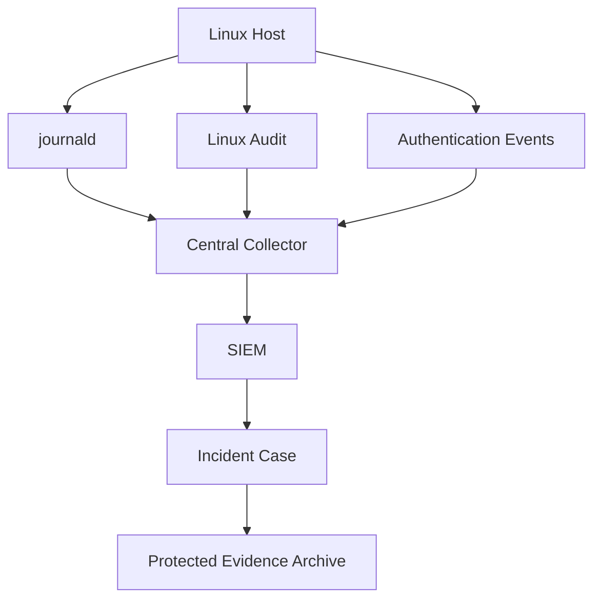
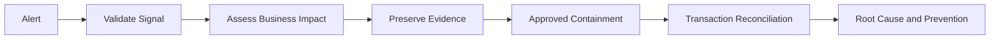

[🏠 Overview](README.md) · [🧠 Concepts](concepts.md) · [🧪 Lab](lab_guide.md) · [🚨 Troubleshooting](troubleshooting.md) · [🎯 Interview](interview_questions.md) · [📸 Evidence](screenshot_checklist.md)

---

# 🏗️ Security Audit Architecture

## Evidence Pipeline

## Incident Decision Flow

## Design Rules
Centralize time, preserve source metadata, restrict access, monitor pipeline health, define retention, correlate deployment/business events, and maintain a recovery path.

---

**🏦 FinBank AI DevSecOps · Day 013 of 120**
*Observe · Audit · Investigate · Validate · Document · Improve*
