# 🧯 Day 014: Enterprise Backup, Recovery & Banking Disaster Readiness

### 🏦 FinBank AI DevSecOps · Resilience Engineering Phase · Day 14 of 120

> [!IMPORTANT]
> Day014 establishes a recovery-first engineering model. A backup is not trusted because a job completed; a backup is trusted only after integrity, restore, reconciliation, security, retention, and recovery-objective evidence are validated.

🟢 **STATUS: READY** · 🔵 **MODE: SYNTHETIC/ISOLATED** · 🟡 **PLATFORM: LINUX** · 🟣 **DOMAIN: BANKING**

## 🧭 Premium Navigation

| Learn | Engineer | Govern | Validate |
|---|---|---|---|
| [Deep Concepts](concepts.md) | [Hands-on Lab](lab_guide.md) | [Security](security_notes.md) | [Testing](testing_strategy.md) |
| [Command Center](commands.md) | [Architecture](architecture.md) | [Banking](banking_relevance.md) | [Evidence](screenshot_checklist.md) |
| [AI Workflow](ai_assisted_workflow.md) | [Troubleshooting](troubleshooting.md) | [Git Workflow](git_workflow.md) | [Executive Summary](summary.md) |

## 🎯 Advanced Outcomes

- Translate business impact into RPO, RTO, retention, restore priority, and recovery tiers.
- Distinguish backup, snapshot, replication, archive, high availability, and disaster recovery.
- Build a deterministic backup manifest with hashes and immutable-style evidence.
- Perform an isolated restore drill and prove file-level integrity.
- Detect missing, altered, stale, duplicate, and unrecoverable artifacts.
- Design banking recovery controls for transaction uncertainty and ledger reconciliation.
- Produce evidence suitable for senior engineering interviews and architecture reviews.

## 📊 Executive Completion Dashboard

| Control Plane | Required Evidence | Status |
|---|---|:---:|
| Repository Safety | branch, root, origin | ⬜ |
| Recovery Objectives | RPO/RTO decision record | ⬜ |
| Backup Inventory | manifest and SHA-256 | ⬜ |
| Isolated Restore | restored files outside source | ⬜ |
| Integrity | source-to-restore comparison | ⬜ |
| Failure Engineering | corrupted-artifact detection | ⬜ |
| Banking Validation | reconciliation checklist | ⬜ |
| Git Governance | clean validator and PR | ⬜ |

## 🏗️ Recovery Assurance Flow

```mermaid
flowchart LR
  DATA[Banking Data] --> CLASSIFY[Classify Criticality]
  CLASSIFY --> OBJECTIVES[RPO RTO Retention]
  OBJECTIVES --> BACKUP[Encrypted Backup]
  BACKUP --> CATALOG[Catalog and Hash Manifest]
  CATALOG --> RESTORE[Isolated Restore Drill]
  RESTORE --> INTEGRITY[Integrity Validation]
  INTEGRITY --> RECON[Business Reconciliation]
  RECON --> EVIDENCE[Recovery Evidence]
```

## 🏦 Banking Recovery Principle

> [!WARNING]
> Infrastructure recovery is not transaction recovery. Payment, ledger, queue, fraud, and reconciliation states must be validated before a banking service is declared recovered.

## 📦 Premium Deliverables

- 17 fully authored documents with callouts, matrices, decision flows, and banking controls
- 5 production-style scripts, including corruption simulation and final validator
- 4 governance templates for recovery architecture, evidence, incident response, and reconciliation
- 10 screenshot milestones with exact names
- 20 advanced interview questions across senior, architect, incident, and banking levels
- 8 deeply structured troubleshooting/RCA scenarios
