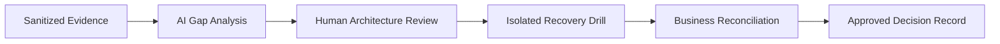

[🏠 Overview](README.md) · [🧠 Concepts](concepts.md) · [🧪 Lab](lab_guide.md) · [🚨 Troubleshooting](troubleshooting.md) · [🎯 Interview](interview_questions.md) · [📸 Evidence](screenshot_checklist.md)

---

# 🤖 AI-Assisted Recovery Engineering

## Safe Prompt Contract
```text
Role: Senior banking resilience architect and SRE
Context: Synthetic recovery objectives, manifests, restore reports, dependency map
Task: Identify gaps, competing designs, failure modes, and validation tests
Constraints: No production data, secrets, destructive actions, or invented evidence
Output: Finding, evidence, risk, architecture option, rollback, test, and banking validation
```

## Human-Governed Workflow


> [!CAUTION]
> AI may propose useful hypotheses, but AI cannot certify recovery, approve business data correctness, or replace evidence from an actual restore drill.

---

**🏦 FinBank AI DevSecOps · Day 014 of 120**
*Protect · Recover · Reconcile · Validate · Document · Improve*
