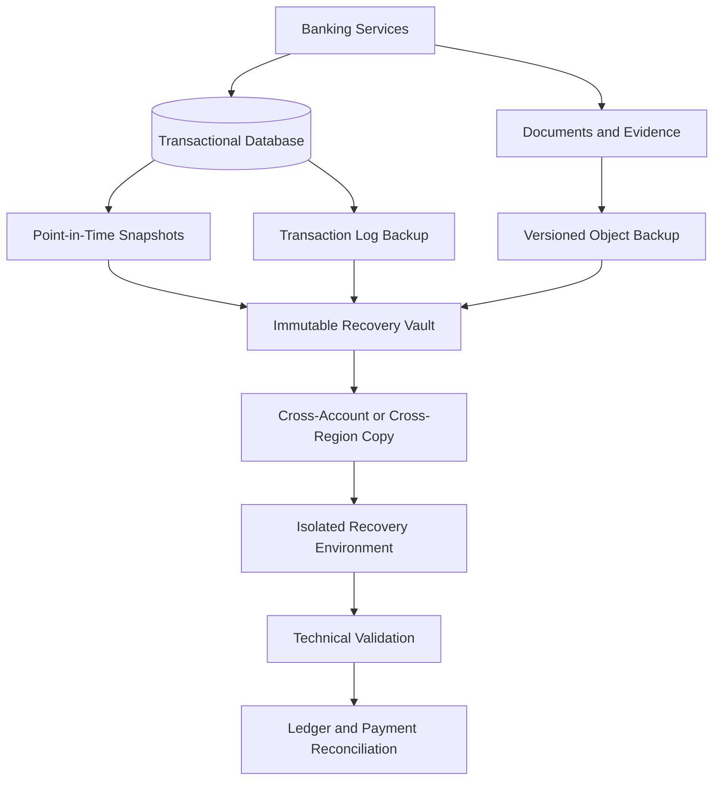
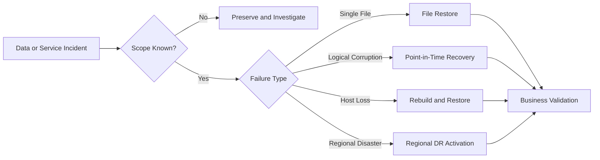

[🏠 Overview](README.md) · [🧠 Concepts](concepts.md) · [🧪 Lab](lab_guide.md) · [🚨 Troubleshooting](troubleshooting.md) · [🎯 Interview](interview_questions.md) · [📸 Evidence](screenshot_checklist.md)

---

# 🏗️ Enterprise Recovery Architecture & Decisions

## Multi-Layer Recovery Architecture

## Recovery Decision Tree

## Control Responsibilities

| Role | Accountability |
|---|---|
| Business Owner | approves RPO/RTO and impact tolerance |
| Data Owner | defines authoritative records and retention |
| Platform/SRE | engineers backup, restore, monitoring, and drills |
| Security | encryption, immutability, access, and incident controls |
| Audit/Risk | evidence, exceptions, and control assurance |

> [!CAUTION]
> Recovery credentials and encryption keys must not share the same compromise path as production administration.

---

**🏦 FinBank AI DevSecOps · Day 014 of 120**
*Protect · Recover · Reconcile · Validate · Document · Improve*
