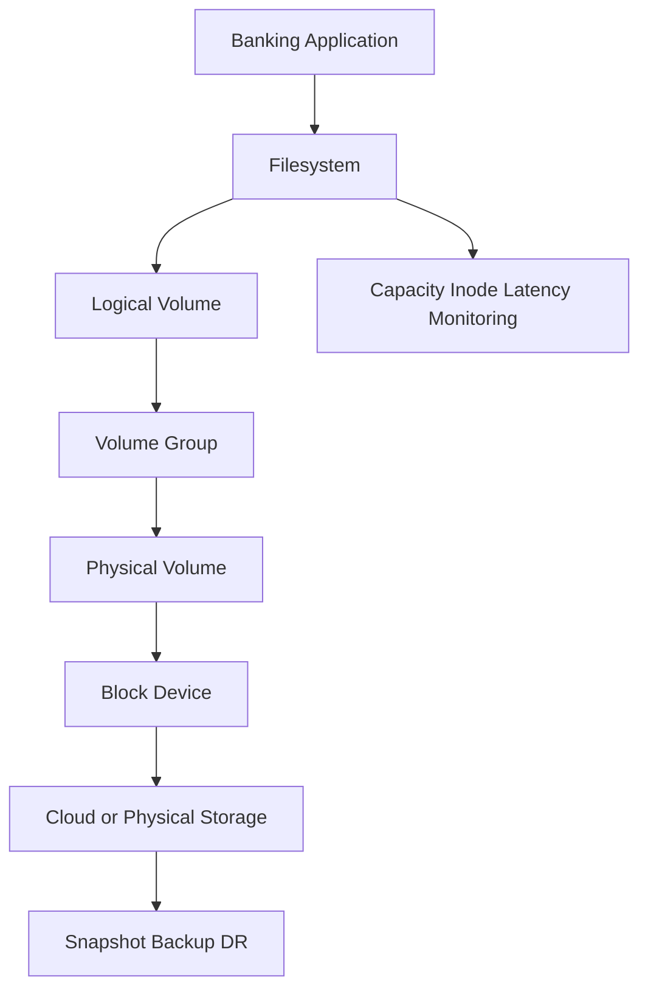

# 💽 Day 015: Enterprise Linux Storage, LVM & Banking Data Governance

### 🏦 FinBank AI DevSecOps · Resilience Engineering Phase · Day 15 of 120

> [!IMPORTANT]
> Day015 is a read-only storage-governance lab. It converts block-device, filesystem, mount, capacity, inode, and LVM evidence into operational decisions without creating partitions, filesystems, volume groups, logical volumes, or cloud disks.

## 🧭 Premium Navigation
| Learn | Engineer | Govern | Validate |
|---|---|---|---|
| [Deep Concepts](concepts.md) | [Lab](lab_guide.md) | [Security](security_notes.md) | [Testing](testing_strategy.md) |
| [Commands](commands.md) | [Architecture](architecture.md) | [Banking](banking_relevance.md) | [Evidence](screenshot_checklist.md) |
| [AI Workflow](ai_assisted_workflow.md) | [Troubleshooting](troubleshooting.md) | [Git](git_workflow.md) | [Summary](summary.md) |

## 🎯 Advanced Outcomes
- Explain the storage stack from device to filesystem and application.
- Interpret `lsblk`, `blkid`, `findmnt`, `df`, inode, and LVM evidence.
- Compare partitions, LVM, RAID, snapshots, filesystems, and cloud block storage.
- Detect capacity, inode, mount-option, growth, and single-failure-domain risks.
- Design banking storage with integrity, availability, encryption, retention, and recovery controls.
- Produce senior-level evidence, architecture decisions, and incident runbooks.

## 📊 Completion Dashboard
| Domain | Evidence | Status |
|---|---|:---:|
| Repository | branch/root/origin | ⬜ |
| Device inventory | block topology | ⬜ |
| Filesystems | types, mounts, options | ⬜ |
| Capacity | bytes and inodes | ⬜ |
| LVM | capability/state review | ⬜ |
| Governance | risk and tier matrix | ⬜ |
| Failure test | invalid scope rejected | ⬜ |
| Git | validator and PR | ⬜ |

## 🏗️ Storage Stack

> [!WARNING]
> Free space alone is not storage health. Validate inodes, latency, error state, mount mode, filesystem health, backup coverage, and business recovery.

## 📦 Premium Deliverables
17 rich documents, 5 scripts, 4 templates, 10 screenshots, 20 advanced interview questions, 8 structured RCA scenarios, completed lab notes, architecture diagrams, banking controls, and strict Git quality gates.
