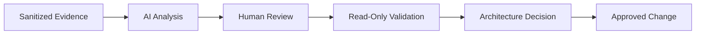

[🏠 Overview](README.md) · [🧠 Concepts](concepts.md) · [🧪 Lab](lab_guide.md) · [🚨 Troubleshooting](troubleshooting.md) · [🎯 Interview](interview_questions.md) · [📸 Evidence](screenshot_checklist.md)

---

# 🤖 AI-Assisted Storage Engineering

```text
Role: Senior Linux storage architect and banking SRE
Context: Sanitized inventory, capacity, inode, mount, latency, and recovery evidence
Task: Rank risks and architecture options
Constraints: No destructive commands, secrets, production IDs, or invented metrics
Output: Finding, evidence, risk, option, rollback, test, banking validation
```



AI assists analysis but cannot approve storage changes or certify transaction integrity.

---

**🏦 FinBank AI DevSecOps · Day 015 of 120**
*Discover · Govern · Validate · Protect · Optimize · Improve*
