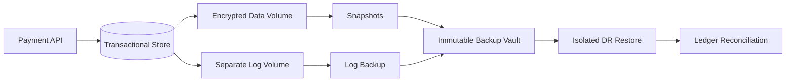
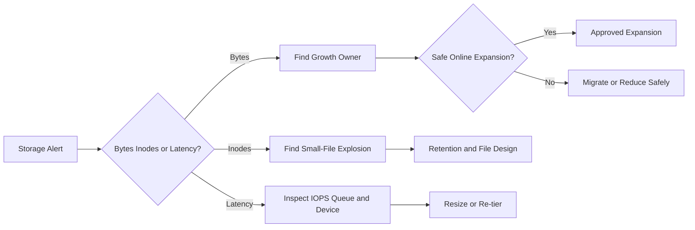

[🏠 Overview](README.md) · [🧠 Concepts](concepts.md) · [🧪 Lab](lab_guide.md) · [🚨 Troubleshooting](troubleshooting.md) · [🎯 Interview](interview_questions.md) · [📸 Evidence](screenshot_checklist.md)

---

# 🏗️ Storage Architecture & Decision Engineering

## Banking Storage Architecture

## Capacity Decision Tree

## Architecture Decision Criteria
| Criterion | Questions |
|---|---|
| Integrity | What is authoritative and consistency-safe? |
| Availability | Which device/AZ failures are tolerated? |
| Performance | Peak IOPS, throughput, latency, queue? |
| Security | Encryption, keys, mount policy, access? |
| Recovery | Snapshot/backup/PITR/restore evidence? |
| Cost | provisioned capacity and growth? |

---

**🏦 FinBank AI DevSecOps · Day 015 of 120**
*Discover · Govern · Validate · Protect · Optimize · Improve*
