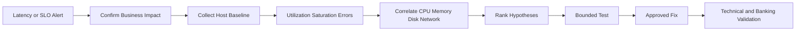

[🏠 Overview](README.md) · [🧠 Concepts](concepts.md) · [🧪 Lab](lab_guide.md) · [🚨 Troubleshooting](troubleshooting.md) · [🎯 Interview](interview_questions.md) · [📸 Evidence](screenshot_checklist.md)

---

# 📈 Day 016: Enterprise Linux Performance Engineering & Banking Operational Readiness

### 🏦 FinBank AI DevSecOps · Performance Engineering Phase · Day 16 of 120

> [!IMPORTANT]
> Day016 builds an evidence-first performance workflow. Optimization starts only after workload, saturation, latency, queueing, capacity, and business impact are correlated.

## 🧭 Premium Navigation

| Learn | Engineer | Govern | Validate |
|---|---|---|---|
| [Deep Concepts](concepts.md) | [Hands-on Lab](lab_guide.md) | [Security](security_notes.md) | [Testing](testing_strategy.md) |
| [Command Center](commands.md) | [Architecture](architecture.md) | [Banking](banking_relevance.md) | [Evidence](screenshot_checklist.md) |
| [AI Workflow](ai_assisted_workflow.md) | [Troubleshooting](troubleshooting.md) | [Git Workflow](git_workflow.md) | [Summary](summary.md) |

## 🎯 Advanced Outcomes

- Interpret CPU utilization, run queue, load average, context switches, and steal time.
- Distinguish memory use, cache, pressure, swap activity, and OOM risk.
- Correlate storage latency, I/O wait, queue depth, throughput, and application symptoms.
- Review network sockets and interface counters without changing the host.
- Build a repeatable baseline with UTC timestamps and synthetic load evidence.
- Translate Linux observations into banking SLO, payment latency, timeout, and reconciliation decisions.

## 📊 Completion Dashboard

| Capability | Required Evidence | Status |
|---|---|:---:|
| Repository safety | root, branch, origin | ⬜ |
| CPU baseline | load, utilization, queue | ⬜ |
| Memory baseline | available, cache, swap | ⬜ |
| Storage baseline | capacity and I/O counters | ⬜ |
| Network baseline | sockets and interface counters | ⬜ |
| Synthetic test | bounded CPU workload | ⬜ |
| Reports | baseline, risk, decision | ⬜ |
| Git governance | validator and PR | ⬜ |

## 🏗️ Performance Investigation Flow

> [!WARNING]
> A high metric is not automatically a root cause. Correlation requires timestamps, saturation evidence, workload context, and business validation.

## 📦 Premium Deliverables

17 rich documents, 5 read-only or bounded scripts, 4 governance templates, 10 screenshot milestones, 20 advanced interview questions, 8 structured production RCAs, completed lab notes, Mermaid diagrams, banking scenarios, and strict rendering/secret validation.

---

**🏦 FinBank AI DevSecOps · Day 016 of 120**
*Measure · Correlate · Diagnose · Validate · Optimize · Improve*
